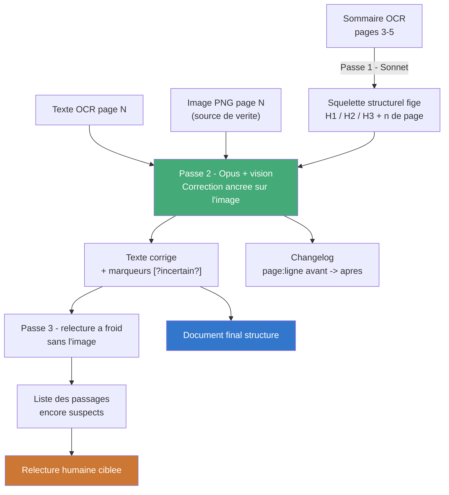

# Déléguer la révision du manuel OCRisé à une IA agentique

## Risque n°1 à neutraliser : l'hallucination silencieuse

Un LLM « corrigeant » de l'OCR a une tendance naturelle à remplacer du bruit
par du texte plausible plutôt que par le texte réel. Sur un manuel
technique, une valeur numérique inventée (`0 to 63` → `0 to 64`) est pire
qu'une faute laissée telle quelle : elle a l'air correcte. Toute
l'architecture du prompt doit être construite autour de ce risque, pas
autour de la qualité de la prose.

## Architecture recommandée : 3 passes, jamais une seule

| Passe | Entrée | Sortie | Modèle |
|---|---|---|---|
| 1. Squelette structurel | Le sommaire imprimé (pages 3-5, déjà OCRisé) | Arborescence de titres **figée** (H1/H2/H3 + numéros de page) | Sonnet suffit |
| 2. Correction ancrée image | Texte OCR de la page **+ l'image PNG de la page** | Texte corrigé + journal des corrections | Opus (vision) |
| 3. Vérification croisée | Sortie passe 2, relue à froid, sans l'image | Liste des passages encore suspects | Sonnet ou Opus |

Le point clé : ne jamais corriger du texte contre du texte. Sans l'image
source, le modèle « corrige » par plausibilité statistique — exactement le
mécanisme qui produit l'hallucination. Les PNG intermédiaires générés par
`convert-pdf-to-text-ocr.ps1 -KeepImages` sont la pièce manquante la plus
rentable de tout le pipeline.



## Le prompt (passe 2 — le cœur du travail)

```
You are correcting the OCR of a page from the Oberheim Xpander manual (1984). You are given:
- the scanned image of the page (absolute source of truth)
- the raw OCR text of this page (contains noise: duplicated glyphs,
  truncated words, false Markdown headings on panel-label rows)

ABSOLUTE RULES:
1. Every corrected word must be visible and legible on the image. If you
   cannot confirm it visually, leave the OCR text as-is and mark it
   [?original_word?] — never invent a plausible replacement.
2. NEVER touch a number, a value range, or a unit (Hz, dB, seconds,
   0-63, etc.) without explicit visual confirmation. When in doubt about
   a digit, mark [?value?] rather than choosing one.
3. Fixed glossary (do not "correct" these terms into anything else):
   VCO, VCF, VCA, LFO, ENV, RAMP, TRACK, FM, LAG, MIDI, CV, DSX, DMX,
   Xpander, Oberheim, patch, zone, tracking generator.
4. A line marked # or ## is a genuine heading only if it matches an
   entry in the reference table of contents supplied below. A row of
   panel labels (e.g. "SPEED WAVE RETRIG AMP") is NOT a heading:
   reformat it as running text or a list, never as a heading.
5. Rejoin an end-of-line hyphenation only if the reassembled word
   actually appears, legible, in the image.
6. Output: the corrected text, THEN a ```changelog block listing every
   correction as `page:line | "before" -> "after" | confidence
   high/medium`. The [?...?] markers do NOT go in the changelog — they
   stay in the text as a signal for human review.

Reference table of contents (pages 3-5 excerpt): {{TOC}}
OCR text of page {{N}}: {{TEXT}}
```

## Découpage : jamais le document entier d'un coup

- **1 appel = 1 à 3 pages**, avec l'image correspondante attachée à chaque
  appel — pas de résumé du contexte précédent, l'image porte toute la
  vérité nécessaire.
- Fournir à chaque appel le **glossaire figé** et le **sommaire figé**
  (passe 1) en contexte constant, pour que la terminologie et la hiérarchie
  des titres restent cohérentes sur les 69 pages sans dérive d'un chunk à
  l'autre.
- Un chevauchement d'1 page entre chunks sert à recoller les paragraphes
  coupés à la frontière, avec instruction explicite « ignore la
  répétition, ne duplique pas ».

## Sonnet vs Opus ici

- **Passe 1 (squelette)** et **passe 3 (vérification à froid)** : Sonnet
  suffit, tâche mécanique.
- **Passe 2 (vision + correction ancrée)** : Opus, parce que la qualité de
  lecture d'image dégradée (police fine, 1984, artefacts de scan) et le
  respect strict de la règle « pas de confirmation visuelle → ne pas
  corriger » demandent le raisonnement le plus fiable — c'est là que se
  joue tout le risque d'hallucination.

## Le point le plus rentable si vous ne retenez qu'une chose

Ne donnez jamais à un agent le texte OCR seul en lui demandant de
« corriger et structurer ». Donnez-lui texte + image + sommaire de
référence + interdiction explicite de deviner, avec un canal de sortie
pour signaler l'incertitude plutôt que la résoudre. C'est la différence
entre un outil qui nettoie et un outil qui invente proprement.
