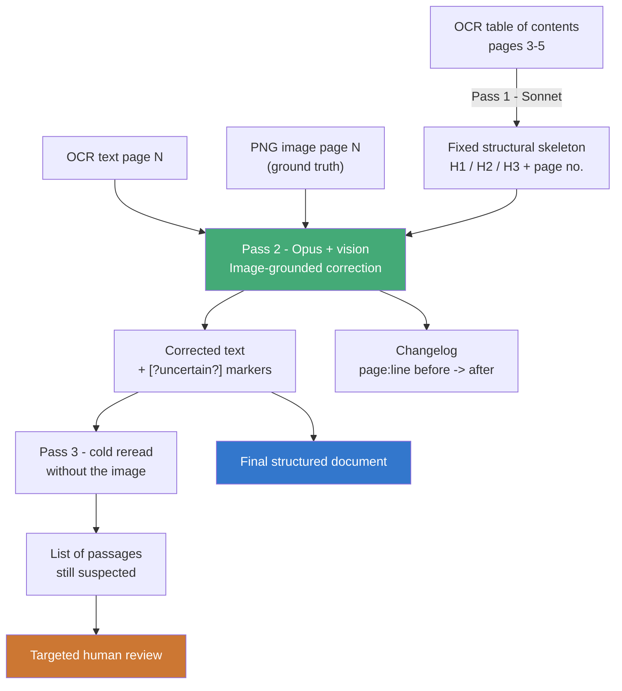

# Delegate review of the OCRed manual to an agentic AI

## Risk #1 to neutralize: silent hallucination

An LLM “correcting” OCR has a natural tendency to replace noise with plausible text rather than with the real text. On a technical manual, an invented numeric value (`0 to 63` → `0 to 64`) is worse than leaving a mistake as-is: it looks correct. The entire prompt architecture must be built around this risk, not around prose quality.

## Recommended architecture: 3 passes, never a single one

| Pass | Input | Output | Model |
|---|---|---|---|
| 1. Structural skeleton | The printed table of contents (pages 3–5, already OCRed) | Fixed title tree (H1/H2/H3 + page numbers) | Sonnet is sufficient |
| 2. Image-grounded correction | OCR text of the page + the PNG image of the page | Corrected text + correction log | Opus (vision) |
| 3. Cross-check verification | Output of pass 2, reread cold, without the image | List of still-suspect passages | Sonnet or Opus |

The key point: never correct text against text alone. Without the source image, the model “corrects” by statistical plausibility — exactly the mechanism that produces hallucination. The PNG intermediary files generated by `convert-pdf-to-text-ocr.ps1 -KeepImages` are the most cost-effective missing piece in the entire pipeline.



## The prompt (pass 2 — the heart of the work)

```
You are correcting the OCR of a page from the Oberheim Xpander manual (1984). You are given:
- the scanned image of the page (absolute source of truth)
- the raw OCR text of this page (contains noise: duplicated glyphs,
  truncated words, false Markdown headings on panel-label rows)

ABSOLUTE RULES:
1. Every corrected word must be visible and legible on the image. If you
   cannot confirm it visually, leave the OCR text as-is and mark it
   [?original_word?] — never invent a plausible replacement.
2. NEVER touch a number, a value range, or a unit (Hz, dB, seconds,
   0-63, etc.) without explicit visual confirmation. When in doubt about
   a digit, mark [?value?] rather than choosing one.
3. Fixed glossary (do not "correct" these terms into anything else):
   VCO, VCF, VCA, LFO, ENV, RAMP, TRACK, FM, LAG, MIDI, CV, DSX, DMX,
   Xpander, Oberheim, patch, zone, tracking generator.
4. A line marked # or ## is a genuine heading only if it matches an
   entry in the reference table of contents supplied below. A row of
   panel labels (e.g. "SPEED WAVE RETRIG AMP") is NOT a heading:
   reformat it as running text or a list, never as a heading.
5. Rejoin an end-of-line hyphenation only if the reassembled word
   actually appears, legible, in the image.
6. Output: the corrected text, THEN a ```changelog block listing every
   correction as `page:line | "before" -> "after" | confidence
   high/medium`. The [?...?] markers do NOT go in the changelog — they
   stay in the text as a signal for human review.

Reference table of contents (pages 3-5 excerpt): {{TOC}}
OCR text of page {{N}}: {{TEXT}}
```

## Chunking: never process the whole document at once

- **1 call = 1 to 3 pages**, with the corresponding image attached to each call — no summary of previous context, because the image carries all the truth needed.
- Provide the **fixed glossary** and the **fixed table of contents** (pass 1) in constant context at each call so that terminology and title hierarchy remain coherent across all 69 pages without drift from one chunk to the next.
- A 1-page overlap between chunks helps rejoin paragraphs split at the boundary, with the explicit instruction “ignore repetition, do not duplicate”.

## Sonnet vs Opus here

- **Pass 1 (skeleton)** and **pass 3 (cold verification)**: Sonnet is enough; this is mechanical work.
- **Pass 2 (vision + grounded correction)**: Opus, because the quality of reading degraded images (fine type, 1984, scan artifacts) and strict adherence to the rule “no visual confirmation → do not correct” require the most reliable reasoning — this is where the hallucination risk is highest.

## The most profitable point if you retain only one thing

Never give an agent OCR text alone and ask it to “correct and structure” it. Give it text + image + reference table of contents + explicit prohibition against guessing, with an output channel for signaling uncertainty instead of resolving it. That is the difference between a tool that cleans text and a tool that invents it elegantly.
