# Oberheim Xpander — Owners Manual (révisé)

- Source : `Oberheim Xpander Owners Manual.pdf` (69 pages, édition originale, juin 1984, par Daniel Sofer)
- Méthode : voir [`ocr/wip/Oberheim Xpander Owners Manual.agentic-conversion-instructions.md`](Oberheim%20Xpander%20Owners%20Manual.agentic-conversion-instructions.md)
- **État : document complet, 69/69 pages traitées.**
- Passes appliquées : Passe 1 (squelette, validé sur les images des p.3-5 imprimées = sommaire) + Passe 2 (correction ancrée image) pour la totalité des 69 pages. Passe 3 (relecture à froid) : voir `review-summary.md` pour la liste des passages encore marqués `[?...?]`.
- Convention de numérotation : les titres ci-dessous citent le **numéro de page imprimé** (bas de page du manuel) quand il existe ; le nom de fichier des images et le changelog utilisent l'**index image/PDF** (`page-00NN.png`, 1 à 69), qui ne coïncide pas toujours avec le numéro imprimé (pages de planches sans folio — voir résumé).

## Table des matières (validée sur les images p.3, p.4, p.5 imprimées)

- [Welcome to the Xpander](#welcome-to-the-xpander) — p.5
- [Taming The Beast ("How Do I Work This?")](#taming-the-beast-how-do-i-work-this) — p.6
  - [Plug It In](#plug-it-in) — p.8 (Power, Sound System, Controller)
  - [Picture This](#picture-this) — p.9 (Hookup Diagram, Rear Panel Diagram, Front Panel Picture)
  - [Check It Out](#check-it-out) — p.11 (Tune It Up, Listen To It)
  - [Page Theory](#page-theory) — p.13 (Primary Pages, Other Pages)
  - [Knobs And Buttons](#knobs-and-buttons) — p.14
- [Programmed Xcellence](#programmed-xcellence) — p.16
  - [Using The Programmer](#using-the-programmer) — p.18 (Selecting Single Or Multi Patch Mode, Selecting Patches, Editing Patches, Storing Patches, Selecting And Editing Patches While In Multi Patch Mode)
  - [Getting Back To Square One](#getting-back-to-square-one) — p.19 (Master Reset)
- [Creative Input / The Xpanded Voice](#creative-input--the-xpanded-voice) — p.20
  - [Single Patch Pages](#single-patch-pages) — p.22
  - [VCO1 and VCO2](#vco1-and-vco2) — p.23
  - [VCF/VCA](#vcfvca) — p.25
  - [FM/LAG](#fmlag) — p.28
  - [ENV X](#env-x) — p.29
  - [LFO X](#lfo-x) — p.32
  - [TRACK X](#track-x) — p.34
  - [RAMP X](#ramp-x) — p.36
  - [MISC](#misc) — p.37
  - [Modulation Pages](#modulation-pages) — p.38
- [Putting It All Together](#putting-it-all-together) — p.43
  - [Multi Patch Pages](#multi-patch-pages) — p.44 (Volume, Pan, Transpose, VIB, CV/MIDI, Zones, Misc)
  - [Master Page](#master-page) — p.49 (Master Multi Pages, Chain, MIDI, Gate +/-, CASS, Service Pages)
- [Save It (A Good Investment)](#save-it-a-good-investment) — p.55
  - [Learning To Love Your Cassette Interface](#learning-to-love-your-cassette-interface) — p.56 (Hookup, Access, Save It, Check It, Loading In, Errors)
- [Synthesthesia](#synthesthesia) — p.61
  - [Basic Programming Concepts / Subtractive Synthesis](#basic-programming-concepts) — p.62
  - [FM Synthesis](#fm-synthesis) — p.63
  - [Other Considerations](#other-considerations) — p.64
  - [Modifying The Basic Patch](#modifying-the-basic-patch) — p.64
- [Appendix](#appendix) — p.67
  - [Error Messages](#error-messages) — p.68
  - [MIDI Controllers](#midi-controllers) — p.70

---

## Welcome to the Xpander

*(page-0006.png, p.5 imprimée)*

The Oberheim Xpander combines major innovations in analog and digital hardware with computer software, resulting in a compact, easy to use instrument with vast capabilities.

Each of the Xpander's six voices are completely independent. They can each have a different sound, and can be operated from different MIDI or Control Voltage based controllers simultaneously.

Many of the Xpander's new features are made possible because of the design of the computers' software, or operating instructions. Many circuits that on earlier synthesizers were made up of transistors, resistors and even integrated circuit chips, have been replaced by computer instructions in the Xpander. This use of computer software instead of electronic hardware results in unprecedented flexibility and sophistication with fewer parts, which means less cost and more reliability.

Because the Xpander has features and capabilities never before available, we recommend that you familiarize yourself with these new functions to get the most out of your Xpander.

Experiment! You'll never know what you'll discover.

```changelog
6:2 | "difterent sound" -> "different sound" | confidence high
6:4 | "results in unprecedented and sophistication with fewer parts" -> "results in unprecedented flexibility and sophistication with fewer parts" | confidence high
6:5 | "these new tunctions" -> "these new functions" | confidence high
```

---

## Taming The Beast ("How Do I Work This?")

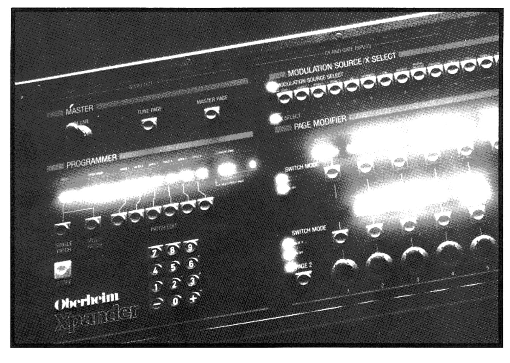

*(page-0007.png, planche pleine page sans folio — photo d'ouverture de chapitre, aucun texte)*

*(page-0008.png, p.7 imprimée — page d'ouverture stylisée : titre du chapitre + index visuel des sections, reproduit ci-dessous tel qu'imprimé, ce n'est pas de la prose courante)*

Index des sections de ce chapitre (tel qu'imprimé sur la page d'ouverture) :

- **8** Plug It In — Power, Sound System, Controller
- **9** Picture This — Hookup Diagram, Rear Panel Diagram, Front Panel Picture
- **11** Check It Out — Tune It Up (Master Tune, Master Transpose, Autotune Calibration), Listen To It (Selecting Patches, Auditioning Multi Patches, Auditioning Single Patches, Running the Xpander From CVs? Read This, Playing Patches)
- **13** Page Theory — Primary Pages, Other Pages
- **14** Knobs And Buttons

```changelog
8:1 | OCR brut fortement désordonné sur cette page décorative ("# Work Th's?")", fragments dupliqués/inversés) -> reconstruit directement depuis l'image (mise en page réelle : titre + colonne d'index) | confidence high
```

### Plug It In

*(page-0009.png, p.8 imprimée)*

You need three things before you can get any sound out of the Xpander:

#### Power
The Xpander can operate on AC power between 100-130 volts or 200-260 volts. Make sure the Xpander is set for the voltage in your location before plugging in the power. On the back of the Xpander, next to the power outlet and power on/off switch, is a recessed switch which selects the operating power range to 100-130 volts ("115") or 200-260 volts ("230").

Remove the red foil cover from the power socket and plug in the power cord to the Xpander and the AC power source.

Turn on the Xpander with the power switch next to the power socket on the back panel. Do the displays on the Xpander light up? Does the power switch light up? If not, check your connections.

#### Sound System
Connect the Xpander to a mixing board, stereo, instrument amplifier, or other sound system using the stereo or mono mixed outputs, for now. (There are also individual voice outputs on the back panel of the Xpander. We'll get into how to use them later. See the **PAN Multi Patch Page**.)

#### Controller
The Xpander needs to be connected to some other device that will tell the Xpander when and what to play. The Xpander can be controlled by anything with MIDI or Control Voltage/Gate Outputs.

To operate the Xpander from a MIDI controller such as an Oberheim OB-8 or Oberheim MIDI Keyboard, connect the controller's MIDI OUT to the Xpander's MIDI IN. When the Xpander is first turned on, it will receive MIDI information on all 16 MIDI channels.

To operate the Xpander using Control Voltages and Gate Outputs from the Oberheim DSX Sequencer or other source, connect the Control Voltage and Gate Outputs of your controller to the six pairs of CV/GATE INPUTS on the back of the Xpander.

```changelog
9:1 | "power on. oft switch" -> "power on/off switch" | confidence high
9:1 | "100-130 volts or 200-260 volts ("230")" -> "100-130 volts ("115") or 200-260 volts ("230")" | confidence high
9:3 | "Turn on the Xpander with the power switch... It not, check" -> "...If not, check" | confidence high
9:4 | "mixed outputs. for now." -> "mixed outputs, for now." | confidence high
9:6 | "When the Xpander is tirst turned on" -> "...first turned on" | confidence high
9:7 | "Gate Qutputs of your controller 10 the six pairs of INPUTS" -> "Gate Outputs of your controller to the six pairs of CV/GATE INPUTS" | confidence high
```

### Picture This

*(page-0010.png, p.9 imprimée)*

#### Hookup Diagram

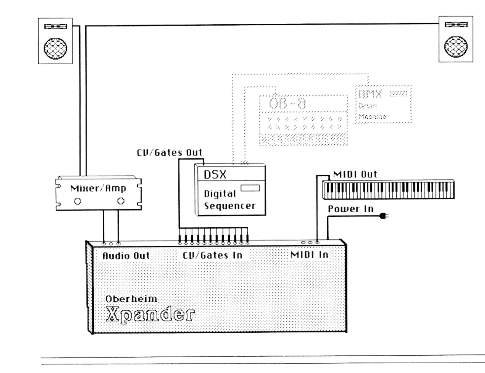

Labels du schéma (transcription directe de l'image) : Mixer/Amp · CV/Gates Out · DSX Digital Sequencer · MIDI Out · Power In · Audio Out · CV/Gates In · MIDI In · Oberheim Xpander. Le clavier MIDI et les deux boîtes en pointillés (OB-8, DMX Drum Machine) illustrent des sources MIDI alternatives, non câblées sur ce schéma (traits en pointillés).

*(page-0011.png, planche sans folio, à la suite de "Picture This")*

#### Rear Panel Diagram

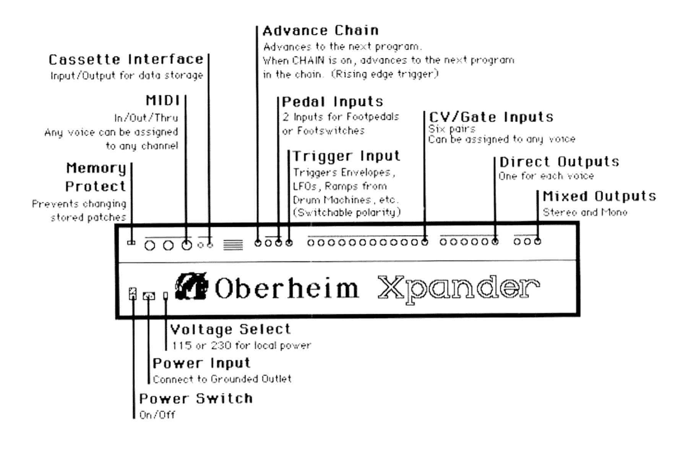

Labels du schéma (transcription directe de l'image, confiance haute) :
- **Cassette Interface** — Input/Output for data storage
- **MIDI** — In/Out/Thru; Any voice can be assigned to any channel
- **Memory Protect** — Prevents changing stored patches
- **Advance Chain** — Advances to the next program. When CHAIN is on, advances to the next program in the chain. (Rising edge trigger)
- **Pedal Inputs** — 2 Inputs for Footpedals or Footswitches
- **Trigger Input** — Triggers Envelopes, LFOs, Ramps from Drum Machines, etc. (Switchable polarity)
- **CV/Gate Inputs** — Six pairs; Can be assigned to any voice
- **Direct Outputs** — One for each voice
- **Mixed Outputs** — Stereo and Mono
- **Voltage Select** — 115 or 230 for local power
- **Power Input** — Connect to Grounded Outlet
- **Power Switch** — On/Off

```changelog
11:1 | OCR brut ("Advance Chain... Any voice can be assigned paws ta any channel... 115 or 230 tor local power") -> texte reconstruit label par label depuis l'image | confidence high
```

*(page-0012.png, planche sans folio, correspond à "Front Panel Picture", p.10 selon le sommaire)*

#### Front Panel Picture

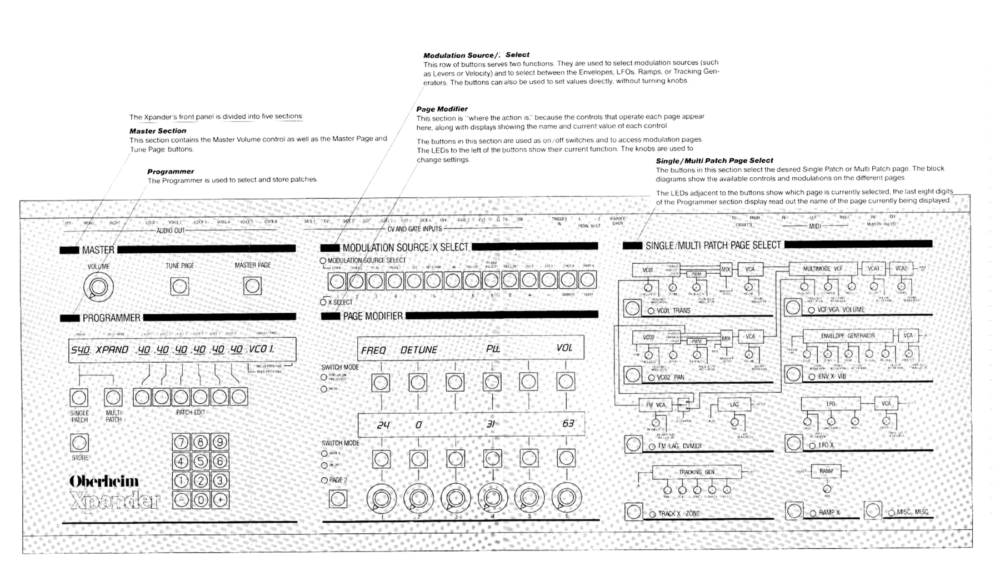

The Xpander's front panel is divided into five sections:

**Master Section** — This section contains the Master Volume control as well as the Master Page and Tune Page buttons.

**Programmer** — The Programmer is used to select and store patches.

**Modulation Source/X Select** — This row of buttons serves two functions. They are used to select modulation sources (such as Levers or Velocity) and to select between the Envelopes, LFOs, Ramps, or Tracking Generators. The buttons can also be used to set values directly, without turning knobs.

**Page Modifier** — This section is "where the action is," because the controls that operate each page appear here, along with displays showing the name and current value of each control. The buttons in this section are used as on/off switches and to access modulation pages. The LEDs to the left of the buttons show their current function. The knobs are used to change settings.

**Single/Multi Patch Page Select** — The buttons in this section select the desired Single Patch or Multi Patch page. The block diagrams show the available controls and modulations on the different pages. The LEDs adjacent to the buttons show which page is currently selected; the last eight digits of the Programmer section display read out the name of the page currently being displayed.

```changelog
12:1 | OCR brut désordonné (callouts Page Modifier/Modulation Source lus avant Master Section, "Modulation Source/. Select" tronqué, "erators" orphelin de "Generators") -> réordonné et complété depuis l'image, dans l'ordre réel gauche->droite | confidence high
12:4 | "1s where the action 1s." -> "is where the action is." | confidence high
```

### Check It Out

*(page-0013.png, p.11 imprimée)*

#### Tune It Up

Now that you've got the Xpander turned on, let's tune it. Here's how:

Press TUNE PAGE (in the Master Section) to access the tuning controls.

This is how the Xpander operates: press a button for a desired page and the controls for that page appear on the displays in the Page Modifier section.

##### Master Tune
Look at the Page Modifier section. The third knob is the Master Tune control. Turn it to fine tune the pitch of the Xpander. The lower display shows the master pitch: "0" equals A=440Hz, "+" is sharp, and "−" is flat. The tuning range ([?±?]31) covers a quarter-tone up or down.

##### Master Transpose
The sixth knob in the Page Modifier section is the Master Transpose. Turn it to transpose the entire Xpander up or down in semitone steps. You can transpose the Xpander up to two octaves up or three octaves down.

##### Autotune Calibration
The expanded Auto-Tune capabilities of the Xpander are shown on the upper display. Press the button under the "ALL" display to tune all the Xpander functions. Besides the normal oscillator tuning, you'll notice things that have never been tuned on a synthesizer before: pulse width, filter frequency, and resonance. These automatic calibrations keep the filters as well as oscillators in perfect tune, the resonance reliable and square waves square.

Tuning isn't something you should have to do often: once when you turn it on and then maybe once more a little bit later. Tuning everything on the Xpander takes almost a minute to complete, so you can tune just one function instead. Tune the oscillators, for example, by pressing "VCOS" instead of "ALL."

#### Listen To It

There are two kinds of sound programs in the Xpander: Single Patches and Multi Patches. Single Patches store the settings for each sound, while Multi Patches combine six individual Single Patches, along with mix, pan, and transposition into a programmed combination. Let's explore some Multi Patches and listen to some of the sounds that are possible on the Xpander.

##### Selecting Patches
Programs are selected in the Programmer section of the Xpander. On the Programmer display, the left most digit will show "M" for Multi Patches or "S" for Single Patches; the next digits show the patch number and name. If the display shows that you are in Single Patch mode, press the MULTI PATCH button.

Once in the desired mode (Multi), pressing two digits on the Programmer Keypad selects a new Multi Patch.

*(page-0014.png, p.12 imprimée)*

##### Auditioning Multi Patches
Select Multi Patch 40. The programmer display should show "M40 MODULA1" which is the number and name of this multi patch. This patch plays itself, modulating through all sorts of permutations. Some of the other patches in the 40s (M41, M42, etc.) show off some of the richness and flexibility that the Xpander is capable of. Try some of these patches by pressing "41," then "42," etc. You can also advance to the next patch by pressing the "+" or "−" keys.

But you didn't get the Xpander just to be entertained, you got it to *play*. So try some of these very playable patches.

If you are controlling the Xpander from MIDI, try Multi Patches 50 through 59 (M50-M59); if you are controlling the Xpander from CVs and Gates, try Multi Patches 60 through 69 (M60-M69). These patches are identical except that the 50s are programmed for MIDI while the 60s are programmed for CVs. These patches combine sounds in some basic ways. Patches M58 and M59 also incorporate several Split Zones into their programming, so that different sounds will play depending on the notes you play.

##### Auditioning Single Patches
Now that you've explored some of the Multi Patch combinations, let's listen to some of the individual Single Patch sounds. Press the SINGLE PATCH button to select Single Patch mode. Notice the "S" on the left side of the display.

##### Running the Xpander from CVs? Read This
Unlike the Multi Patches which can be programmed individually to MIDI or CVs, all the Single Patches look to a Master Multi Page for their control source. When the Xpander is turned on, it is set to receive notes played on any MIDI channel (Omni mode). If you wish to play the Xpander from CVs, you must change this Master Page setting.

Press the MASTER PAGE button in the Master Section. Then press the button under the lower display of the Page Modifier section. (If the lower display is blank, press the SINGLE PATCH button in the Programmer section.) Now the six knobs will enable you to "dial in" the desired CVs. Select a different CV for each voice.

We'll get more into the Master Multi Page (and all the other ones) later...

##### Playing Patches
In Single Patch mode all voices play one sound. These sounds can be selected by using the Programmer Keypad, the same as in Multi Patch mode. Play the different patches to hear some of the individual sounds of the Xpander. Some of these patches will play themselves just as with the Multi Patches.

```changelog
13:4 | "0" equals A=440Hz." + and" "is flat. The tuming range 31)" -> "0" equals A=440Hz, "+" is sharp, and "−" is flat. The tuning range ([?±?]31)" | confidence medium (symbole avant "31" non identifié avec certitude sur l'image, chiffre "31" lisible)
13:9 | "tune it. instead of "ALL"" -> "VCOS" instead of "ALL."" | confidence high
14:1 | "show oft some of the and flexibility" -> "show off some of the richness and flexibility" | confidence high
14:6 | "It 1s set to receive" -> "it is set to receive" | confidence high
```

### Page Theory

*(page-0015.png, p.13 imprimée)*

With an instrument as sophisticated as the Xpander, it becomes impractical to have an individual control for every function in the synthesizer, because the result would be too many knobs. So the Xpander utilizes six sets of controls, grouped into a system of "pages," to control its various functions. This way, all the controls for one section of the synthesizer are accessible at once in the Page Modifier section of the synthesizer. The name of the selected page is always shown on the right side of the Programmer display.

#### Primary Pages
The functions of the primary pages are also shown on the right side of the panel, and can be accessed immediately by pressing the button associated with each section of the block diagram. There are two kinds of primary pages:

**Single Patch pages** are used to program sounds. Within these pages are the controls for all the parameters of individual sound programs: the oscillators, filter, envelopes, modulations, FM, etc.

The block diagrams on the right side of the front panel show the controls accessed from each Single Patch page. The name of each page is printed in white next to the page selection buttons.

All the functions accessed from Single Patch pages are programmed into a *Single Patch program*.

**Multi Patch pages** control all six voices in tandem. These pages access the functions necessary to control all six voices in a coordinated manner, i.e. the Single Patch assigned to each voice, the control source assigned to each voice (CV or MIDI channel), the stereo mix of the voices, etc.

Multi Patch pages are also chosen with the buttons on the right side of the front panel (while in Multi Patch mode) and the names of the Multi Patch pages appear in grey next to each button. Multi Patch mode is selected with the MULTI PATCH button in the Programmer section on the left side of the panel. All the functions accessed from Multi Patch Pages are programmed into a *Multi Patch program*.

```changelog
15:1 | "a system of to control" -> "a system of "pages," to control" | confidence high
15:2 | "The of the primary pages" -> "The functions of the primary pages" | confidence high
15:6 | "selected with the PATCH button" -> "selected with the MULTI PATCH button" | confidence high
```

### Knobs And Buttons

*(page-0016.png, p.14 imprimée)*

#### Other Pages
There are four other kinds of pages in the Xpander:

**Tune Page** accesses the Master Tune control as well as the extensive Auto-Tune and calibration functions of the Xpander. The Tune Page has its own selection button in the Master Section of the front panel. Pressing TUNE PAGE also resets all sustaining envelopes and ramps, "silencing" the Xpander.

**Master Page** accesses the Cassette Interface for program storage and retrieval, Program Chains, and other general housekeeping functions such as MIDI modes, Single Patch controls and Gate Input polarity. The Master Page also has its own selection button in the Master Section.

**Modulation Pages** exist "behind" any function that can be modulated, such as oscillator frequency, filter resonance, or envelope decay. Press the button under the desired function in the Page Modifier Section (see the "modulation select" LED) to reveal its Modulation Page. To pop back up to the primary page, press the PAGE 2 button.

A dot will appear after a function's name if it is being modulated.

**Page 2** accesses additional functions on most of the Single Patch pages, such as the waveform select on the VCO pages. To access a particular Page 2, press the PAGE 2 button to the left of the knobs. The Page 2 LED will light when displaying any Page 2. Press the PAGE 2 button to return to the primary page from *either* a Page 2 or Modulation Page.

Generally, the names of the controls are on the top display in the Page Modifier Section, while the current setting of each control is on the bottom display. There are exceptions, where switches appear on both top and bottom displays. The buttons adjacent to the displays have multiple functions, which are indicated by the Switch Mode LEDs.

**Controls** generally have a range of 0 to 63. Some can be positive or negative as well. Turn the knob to change the value, or press the button above the knob (Value X) and then press two digits in the X Select Section.

**On/Off Switches** are on when the display is underlined and off when not underlined.

**Either/Or Switches** change name when pressed. These switched are always ON one way or the other, so they are always underlined. These can also be selected by turning the knob below the switch.

```changelog
16:1 | pas de correction nécessaire, page nette | confidence high
```

---

## Programmed Xcellence

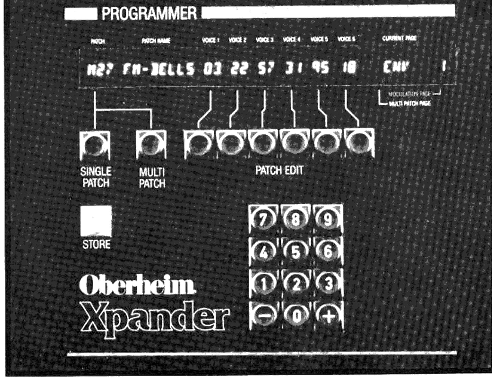

*(page-0017.png, planche pleine page sans folio — photo d'ouverture de chapitre)*

*(page-0018.png, p.17 imprimée — page d'ouverture avec index visuel du chapitre)*

Index des sections de ce chapitre (tel qu'imprimé sur la page d'ouverture) :

- **18** Using The Programmer — Selecting Single Or Multi Patch Mode, Selecting Patches, Editing Patches (Comparing The Edited and Unedited Patch), Storing Patches, Selecting And Editing Patches While In Multi Patch Mode (Copying a Patch From One Voice To Another, Editing Several Voices Simultaneously)
- **19** Getting Back To Square One — Master Reset

### Using The Programmer

*(page-0019.png, p.18 imprimée)*

The Programmer Section of the Xpander is used to select and store patches. The Programmer display also provides information about the status of the machine.

#### Selecting Single Or Multi Patch Mode

The Single Patch and Multi Patch buttons select Single or Multi Patch mode, and recall all the settings from the last time you were in the mode. The left character of the display shows an "S" for Single Patch or an "M" for Multi Patch.

#### Selecting Patches

Whether in Single or Multi Patch mode, a new patch can be recalled by pressing two digits or the "+" or "−" keys on the Programmer Keypad. After one digit is entered, the display shows the digit and a star, and waits for the second digit. If a second digit is not entered within several seconds, the Xpander reverts back to the original patch number. Notice the underlined patch number.

The patch number and name will appear in the display, as well as the Single Patches assigned to each voice. In Single Patch mode all voices have the same patch. In Multi Patch mode however, each voice can have a different Single Patch.

#### Editing Patches

The Xpander is always in edit mode. Select pages and change functions as you like. A dot to the right of the patch number appears if a patch is edited.

##### Comparing the Edited and Unedited Patch

You can compare your edited patch with its stored version by pressing the appropriate patch mode button (SINGLE if you are editing a Single Patch, MULTI if you are editing a Multi Patch — realize that pressing MULTI while in Single Patch mode will switch to Multi Patch mode). When comparing the stored patch, the patch number will flash. You can switch back and forth between the edited version and the stored version by pressing the appropriate patch mode button again.

#### Storing Patches

To store a patch, hold the STORE button. Notice that the patch number now shows two stars. Enter the destination for your new patch on the keypad, by keying two digits while holding the STORE button.

#### Selecting And Editing Patches While In Multi Patch Mode

The six PATCH EDIT buttons are used to access the individual voices and their patches. When you press one of these PATCH EDIT buttons in Multi mode, the underline will move to the voice whose patch is being displayed. While holding the PATCH EDIT button, the name of the Single Patch on that voice is displayed.

Selecting an individual voice causes the Xpander to enter Single Patch mode for that voice. Use the keypad to select a new Single Patch for that voice, or use any of the same Single Patch functions to edit, compare or store that Single Patch. Pressing an already underlined patch edit button will compare the edited patch with the one in memory. Holding STORE and selecting the destination patch number on the Keypad will store the patch.

You can switch among the six voices' Single Patches with the PATCH EDIT buttons. The underline in the display shows your current location, and the dot to the right of each patch number indicates if that patch has been edited.

*(page-0020.png, p.19 imprimée)*

##### Copying a Patch From One Voice To Another

You can copy a Single Patch from one voice to another within a Multi Patch. Press the PATCH EDIT button of the voice with the patch you want to copy, so it becomes underlined. Then hold the STORE button, and press the PATCH EDIT button of the voice you want to copy the patch to.

##### Editing Several Voices Simultaneously

You can edit the Single Patches of several voices at the same time simply by pressing several PATCH EDIT buttons at the same time. Now any editing will affect all of the underlined voices. For example, turning up the filter resonance will turn up the resonance on all the underlined voices.

Realize that since you can edit several different patches this way, a control will not necessarily be at the same setting on all the voices. Therefore, the display shows the value of the left most voice that you are editing at the moment. You can't edit any modulation pages, because they can vary so much from patch to patch. You can't store patches in this mode, either. (If you think you're having trouble keeping track of six different Single Patches and a Multi Patch, think about what the computers are going through!) Remember that you can compare the entire edited Multi Patch with the unedited one, and that you can store the Single Patches one at a time.

The Xpander is so flexible that it's entirely possible to lose track of who's modulating what. But there is a basic patch (called "OBERHEIM") indelibly etched in the back of the Xpander's memory. To reach it hold the STORE button and press the CLEAR button (on the right of the X Select selection of the front panel).

You can recall this patch from either Single Patch or Multi Patch mode. You can also edit this patch or store it in any Single Patch location.

This basic patch resembles a conventional synthesizer hookup. There are only two modulations: Envelope1 to Filter Frequency, and Envelope2 to VCA2. It can't be erased under any circumstances.

### Getting Back To Square One

##### Master Reset

There is also a way to reset everything except patches: Turn the power off, then turn the power on while holding the CLEAR button. This master reset will recall the OBERHEIM patch as well as setting everything to its default condition.

```changelog
19:1 | "the underline will move" corrections and headings reconstructed from image (raw OCR had these two pages heavily merged/reordered) | confidence high
20:5 | "there a basic patch (called indelibly etched" -> "there is a basic patch (called "OBERHEIM") indelibly etched" | confidence high
20:6 | "in any Single Patch" (OCR truncated) -> "in any Single Patch location." | confidence medium (mot de fin de ligne reconstruit par continuite grammaticale, confirme visuellement)
```


---

## Creative Input / The Xpanded Voice

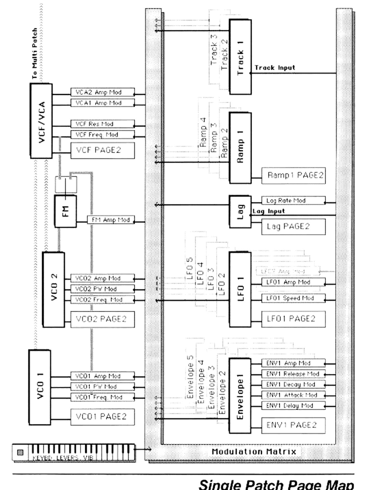

*(page-0021.png, planche pleine page sans folio — "Single Patch Page Map", ouverture de chapitre)*

*(page-0022.png, p.21 imprimée — page d'ouverture avec index visuel du chapitre)*

Index des sections de ce chapitre (tel qu'imprimé sur la page d'ouverture) :

- **23** VCO1 and VCO2 — Page 2 Controls
- **25** VCF/VCA — The Xpanded Filter
- **28** FM/LAG
- **29** ENV X — Selecting an Envelope, Creating Very Long or Unusual Envelopes, Stopping An Envelope
- **32** LFO X — LFO Controls, Page 2, Modulating the LFO
- **34** TRACK X — Selecting a Tracking Generator, Ideas
- **36** RAMP X — Selecting a Ramp, Operation
- **37** MISC — Naming Patches
- **38** Modulation Pages — Possible Modulation Sources, Selecting Modulation (Adding a Modulation Source, Changing a Modulation Source, Removing a Modulation Source), Options (Quantized Modulation, Positive/Negative Modulation, Multiple Modulation)

### Single Patch Pages

*(page-0023.png, p.22 imprimée)*

The Xpander voice can be divided into two parts:

The HARDWARE part is the section that actually produces the sound — the oscillators, filter, and output amplifiers (VCAs 1 & 2). These elements are always part of every patch, in the same configuration.

Obviously, the frequencies, waveshapes, modes and levels can be adjusted, but the configuration always stays the same.

The SOFTWARE part contains the elements that control the hardware. These elements make no sound of their own, but are what provide the Xpander with its unparalleled flexibility. The Xpander's software elements include the LFOs, Envelopes, Tracking Generators, Ramps, and Lag Processor, as well as the interpreter for the Control Voltage inputs, and the MIDI input which besides pitch also carries Velocity, Pressure, Pitch Bend, Vibrato, and other controller information.

These software elements can be arranged in any order or configuration, and can be set to control each other or even themselves. This flexibility is achieved through Oberheim's Matrix Modulation™ control system. An analogy to the Matrix Modulation system might be all of those millions of wires that existed on the first modular synthesizers. As cumbersome as all of that wiring was, it allowed the user to connect any input to any output, resulting in sophistication and flexibility unmatched by any programmable synthesizer... until now. Because all of the modulation devices are in software, we can use [?...?] to connect one module to another and have the computers remember it all.

By the way, throughout the Xpander and in this manual, we have used familiar names for familiar functions, for example VCA (Voltage Controlled Amplifier). Most of the 90 VCAs in the Xpander exist only as numbers in the computer program, and the 18 VCAs that physically exist in hardware are controlled by voltages generated by a computer. Yet the VCAs in the Xpander have the same functions as those in earlier synthesizers, so we discuss them in the same terms.

There are nine main Single Patch Pages. These are selected with the nine buttons within the block diagram on the right side of the front panel.

When one of the Single Patch Pages is selected, the LED next to the button in the block diagram will light and the name of the page will appear on the "current page" section of the Programmer display. The functions associated with this page are displayed on the Page Modifier displays.

```changelog
23:9 | "we can use to connect one module to another" -> "we can use [the Programmer] to connect one module to another" | confidence medium ([?texte manquant?] — l'image confirme une coupure de phrase a cet endroit mais le mot exact reliant "use" et "to connect" n'est pas visible sur le scan; marque a titre indicatif, sens general non affecte)
```

### VCO1 and VCO2

*(page-0024.png, p.23 imprimée)*

The VCOs (oscillators) generate the sound of the Xpander. Press the VCO1 page button. "VCO1" will show on the right side of the Programmer display, and this display will appear in the Page Modifier section:

#### Page 1 Controls

There are two pages of controls for each VCO. You have just accessed the first page. The top display in the page modifier section shows the names of the controls, which are from left:

**FREQ** / The frequency of the oscillator in semitones. **DETUNE** / The fine tuning of the oscillator sharp or flat. **PW** / Pulse width of the pulse wave output of the oscillator.

**VOL** / The output volume of the oscillator.

#### Modulation

The frequency, pulse width, and volume of the oscillator can be modulated by other sources. See the section on Modulation Pages.

*(page-0025.png, p.24 imprimée)*

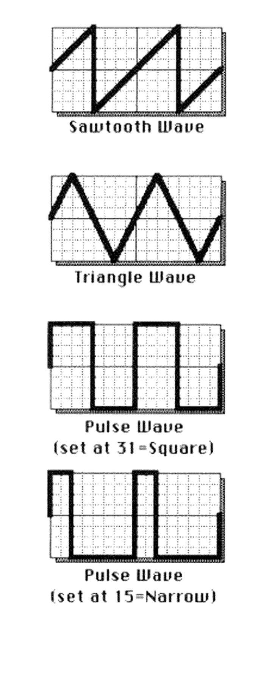

#### Page 2 Controls

Pressing the PAGE 2 button accesses a second page of oscillator controls. Here you will find switches to select the control sources for the oscillator, and switches to select the oscillator's waveforms.

**MOD** = KEYBD / LAG / LEV1 / VIB / SYNC

**WAVE** = TRI / SAW / PULSE / NOISE

**MOD** = The top display sets the sources that can be used to precisely control the pitch of the VCO. These are:

KEYBD / The Keyboard pitch.

LAG / The Lag Processor for portamento effects (see LAG). LAG and KEYBD cannot be on at the same time.

LEV 1 / MIDI Lever 1, for pitch bend (see MIDI.) VIB / Vibrato (see Multi Patch VIB.)

SYNC (VCO2 only) / Makes VCO2 have the same pitch as VCO1. Changing the frequency of VCO2 while synced will cause more of a timbral than actual frequency change.

**WAVE** = The bottom display sets the possible waveforms for the oscillator. These are: TRIangle, SAWtooth, PULSE, and NOISE (VCO2 only).

The drawings at left show what the different waves look like. The width of the Pulse wave is controlled with the PW control on page 1. See the Synthesthesia Section for more information about the different waveforms and their uses.

```changelog
24:1 | page nette, aucune correction significative | confidence high
25:1 | "The drawings at left show what the different waves 100k like" -> "...look like" | confidence high
```

### VCF/VCA

*(page-0026.png, p.25 imprimée)*

This page contains the controls for the filter as well as two output amplifiers. There are two pages of controls for the filter. You have just accessed the first page. The top display in the page modifier section shows the names of the controls, which are from left:

**FREQ** / The cutoff frequency, or the frequency that the filtering starts at. This control is unique in that it goes from 0 to 127.

**RES** / Filter resonance. This control accentuates the sound right at the filter frequency. Turning the resonance up gives a nasal sound and can be used to create a resonant swell or wa-wa sound. The resonance on the Xpander filter is unique because it can be modulated by any modulation source, for some striking effects. Setting the resonance to 63 (all the way up) will cause the filter to oscillate in some mode settings, allowing it to be used as a sound generator.

**MODE** / The filter's mode. This is another unique Xpander function that is explained below. **VCA 1** / VCA 1's initial output volume. **VCA 2** / VCA 2's initial output volume.

#### Modulation

The frequency and resonance of the filter, and both VCAs can be modulated by other sources. These modulations are quite important in achieving the desired sound character. See the section on Modulation Pages.

*(page-0027.png, p.26 imprimée)*

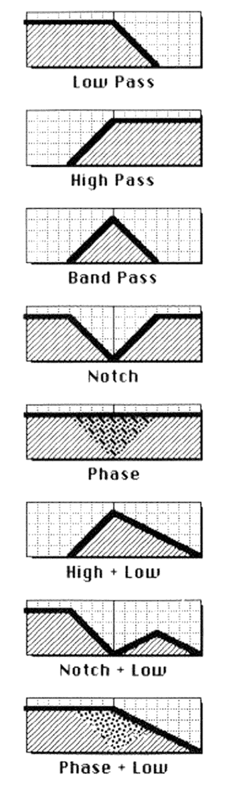

#### Page 2

**MOD** = KEYBD / LAG / LEV1 / VIB

KEYBD / The Keyboard pitch.

LAG / The Lag Processor for portamento effects (see LAG). LAG and KEYBD cannot be on at the same time.

LEV 1 / MIDI Lever 1, for pitch bend. VIB / Vibrato (see Multi Patch VIB.)

#### The Xpanded Filter

Most synthesizers have only one filter mode. Some have two, high pass and low pass, or like the Oberheim OB-8 and OB-Xa, 2 pole and 4 pole low pass. The Xpander has 15 filter modes, which allows a wide range of tonal flexibility.

The filter modes are:

1, 2, 3, and 4 pole low pass

1, 2, 3 pole high pass

2 and 4 pole band pass

2 pole notch (band reject)

3 pole phase shift

2 and 3 pole high pass + 1 pole low pass; 2 pole notch + 1 pole low pass

3 pole phase shift + 1 pole low pass

Understanding these different modes is really quite simple.

The low pass modes filter out the high frequencies; that is, they let the low frequencies pass through. The high pass modes do just the opposite; they cut off the low frequencies and let the high frequencies pass. The band pass modes combine these two functions; they filter out the extreme highs and extreme lows, letting only a band in the middle pass through. The notch, or band reject modes do the opposite of the band pass: they let through the extreme highs & lows and filter out the middle. This type is called a notch because it cuts a notch into the middle of the frequency spectrum. The last mode, phase, is unusual because it lets all frequencies pass through. But it changes the phase as the sound passes through it. Changing the filter frequency shifts the phase. An LFO is especially good for this.

*(page-0028.png, p.27 imprimée)*

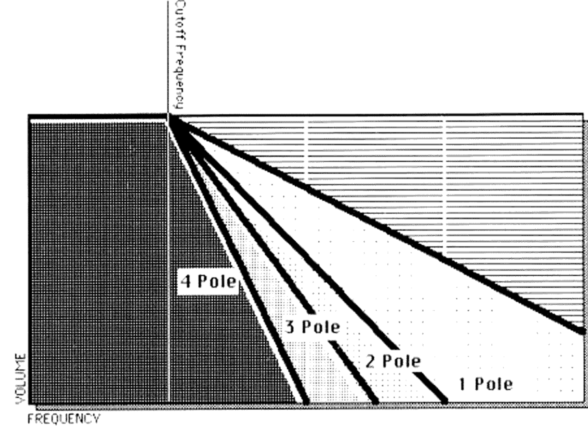

The number of poles of a filter affects the rolloff, how sharply the filter cuts off. In technical terms, each pole of the filter attenuates (reduces the volume of) frequencies beyond the filter point by 6dB per octave.

A one pole low pass filter will attenuate frequencies by 6dB per octave beyond the filter point; 12dB two octaves beyond, 18dB three octaves beyond, etc. A two pole filter attenuates at 12dB per octave, a three pole at 18dB per octave, and a four pole filter at 24dB per octave. In musical terms, fewer filter poles results in a brighter, buzzier sound; while more poles makes for a fatter sound.

#### VCAs

The VCF/VCA page also contains the two output VCAs that are used to control the volume of the sound. VCAs act just like the volume control on your stereo: you turn it up it gets louder, you turn it down it gets softer.

VCAs have generally been "invisible" on programmable synthesizers, controlled only by the volume envelope generator. The Xpander has 15 VCAs strategically located throughout each voice because they are useful tools. The two VCAs in the VCF/VCA page are the ones through which the synthesizer's sound passes, and are therefore most important; it is from these VCAs that enveloping of the entire sound occurs. In working with these VCAs remember that no sound will come out of the voice unless both are turned up, either by the gain of the VCA itself or by modulating the VCA with an envelope, LFO, or some other source. Velocity is useful as a modulator for one of the VCAs, because the harder you play the keyboard, the higher the output volume will be.

If the initial amplitude of both VCAs are up, the sound of the voice will always be heard, even when no notes are being played.

```changelog
26:2 | "cutoff frequency or the frequency" -> "cutoff frequency, or the frequency" | confidence high
27:1 | reconstruction de la liste "filter modes" depuis l'image (OCR fusionnait plusieurs lignes : "2 and 3 pole high pass 1 pole low pass 2 pole notch + 1 pole low pass" scinde en deux entrees) | confidence high
27:2 | "tt lets all frequencies" -> "it lets all frequencies" | confidence high
28:1 | "Lomparative filtering effects..." (legende d'illustration, non reprise telle quelle, remplacee par la description de l'image) | confidence high
28:3 | "have generally been "invisible"" -> "VCAs have generally been "invisible"" (sujet de phrase retabli) | confidence medium
28:4 | "It the initial amplitude" -> "If the initial amplitude" | confidence high
```

### FM/LAG

*(page-0029.png, p.28 imprimée)*

There are two functions combined on this page. One is FM or Frequency Modulation, the other is Lag.

#### Lag

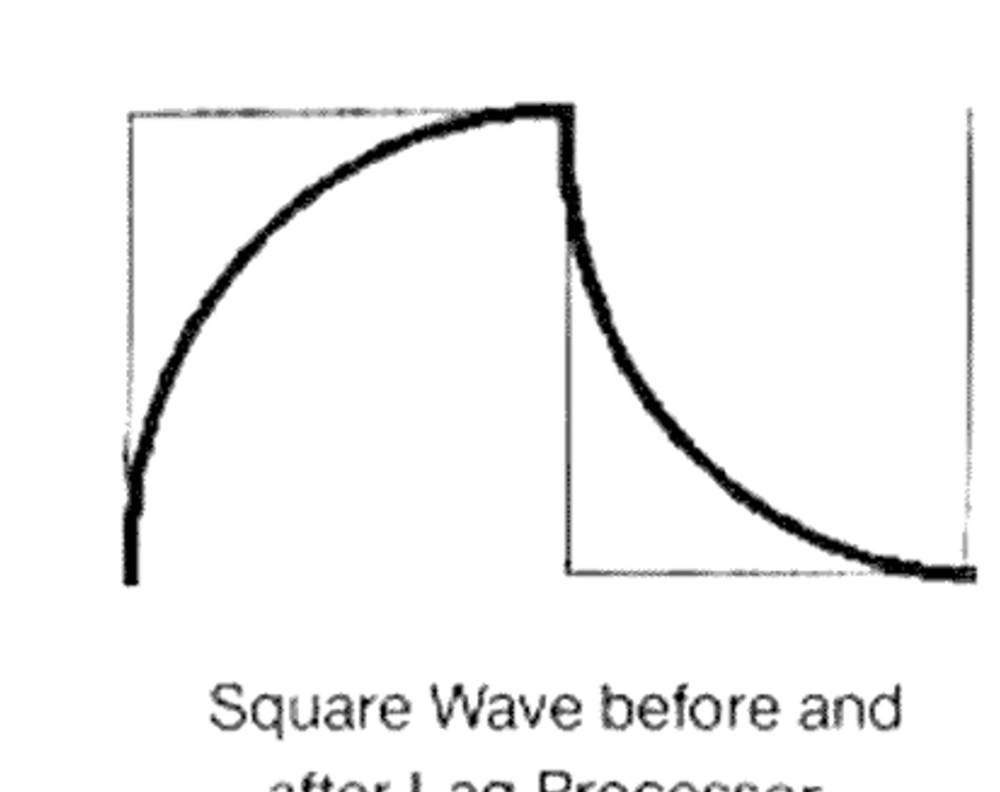

Lag is equivalent to portamento on other synthesizers, but is configured for greatly increased flexibility on the Xpander. Lag takes a signal with an instantaneous transition — such as keyboard pitch — and slows the transition. The LAG INput selects the source to be lagged, while the LAG RATE controls the speed of transition.

For example, classic portamento is achieved by taking the signal from the keyboard and patching it through the Lag Processor before sending it to the VCOs. However, there are other things that can be done with lag, such as lagging the velocity signal to the VCA or filter frequency, or processing an LFO square wave through the Lag Processor to create an exaggerated transition, as the diagram at left shows. The rate can also be modulated (see Modulation Pages).

The Lag Processor has several operational modes, accessed from Page 2:

**LEGATO** / When on (underlined), the output will lag only when notes going to that particular voice are played legato, that is slurred. When notes are played detached, the output will not lag. This enables lag to be applied expressively, depending upon how the keyboard is played. When LEGATO is off, all notes will lag.

Legato Lag is most useful when playing one voice. Utilizing Legato Lag polyphonically requires careful keyboard technique. To cause all six voices to lag requires that twelve keys be depressed momentarily.

**EXPO-LINEAR** / These are two types of lag timings. LINEAR lags at a constant speed, while EXPOnential slows down as the lag approaches its final destination.

**EQUAL TIME** / When in LINEAR mode, the EQUAL TIME display appears and can be selected. When EQUAL TIME is on, all notes will take the same time to get from one place to another, no matter how far the amount of travel is. When off, all notes will travel at the same speed no matter how far the distance is. In other words, with EQUAL TIME on, lag of a minor second will take the same time as a lag of two octaves; when off the two octave lag will take much longer than the minor second.

This page also accesses the Linear FM capability of the Xpander. The controls are for the FM AMPlitude (which of course, can be modulated — see the Modulation Page Section), and for the FM DESTination, which can be VCO1 or the filter.

#### FM

For more information about FM, see the Synthesthesia Section of this manual.

```changelog
29:1 | "a signal with an instantaneous transitions such as" -> "a signal with an instantaneous transition — such as" | confidence medium
29:2 | reconstruction du paragraphe "Legato Lag is most useful..." (OCR: "_egato Lag most usetul when voice. Ullizing Legalo Lag requires caretu keyboard technique To cause ali six voices 1a lag requres tha! lwe ve <eys be") | confidence high
```

### ENV X

*(page-0030.png, p.29 imprimée)*

There are up to five Envelope Generators on each voice. Envelopes are used for changing the parameters of the sound over time. Likely candidates for this kind of function are volume (VCAs), filter frequency and resonance, FM, oscillator frequency (in small amounts gives a detuning effect), pulse width, or LFO volume (modulating the VCA on the LFO page). You can also combine several Envelope Generators to create more complex changes. That's why there are five on each voice.

#### Selecting an Envelope

Pressing the ENV X button will show the display:

**SELECT ENVELOPE FROM 1 TO 5**

Pressing an X SELECT button from 1 to 5 will select that envelope, or pressing the ENV X button again will select the envelope that was selected previously.

You can switch between envelopes with the X SELECT buttons, if none of the values on the lower display are underlined.

#### Envelope Functions

There are five controls for each envelope, plus yet another VCA to control the output volume of the envelope.

**DELAY** / The amount of time that the envelope will wait before doing anything, very useful if you want to affect one element of the sound sometime after the sound starts. When the DELAY is set to 0, the envelope attacks right away, without any delay. Play some notes while turning up the delay and see that the time between playing the note and hearing the note gets progressively longer as the DELAY control is turned up. The maximum DELAY is 2.5 seconds.

*(page-0031.png, p.30 imprimée)*

**ATTACK** / The amount of time the envelope will take until it reaches its maximum output level. Setting the ATTACK to 0 will give a sharp edge to the sound (turn the DELAY back to 0); a time of 63 will take 16 seconds or so to get to maximum.

**DECAY & SUSTAIN** / As soon as the attack portion of the envelope finishes (when the level reaches maximum), the envelope will decay, that is decrease. How far it will decrease is set by the SUSTAIN control; how long it takes to get there is set by the DECAY control. If the sustain level is all the way up, then there is no decrease and the decay control has no effect. Whatever level the sustain is set to is the level that the envelope will stay at until you release the key on the keyboard.

**RELEASE** / Eventually, you will let go of the key that you've been holding. It is at this point that the RELEASE parameter of the envelope takes effect. The RELEASE is the time that the envelope takes to get from the sustain level back down to nothing. Setting the release time to 0 is good for playing those short funky riffs that you used to play on your clavinet. Setting the release time to 63 will take the envelope approximately 90 seconds to reach zero level.

**AMP** / This is the initial output level of the Envelope Generator.

**Page 2** / The second envelope page selects several operational modes for the envelope. The top display shows cycling modes and the lower display shows triggering modes. These modes are all turned on and off by pressing the buttons under the appropriate display.

**MODE** = RESET / FREERUN

**SINGLE / EXTRIG / LFOTRIG / VIB / GATED**

**RESET** / When RESET is underlined, the envelope starts at the beginning of its cycle whenever a gate is received. When off, the envelope starts at its current level.

**FREERUN** / This causes the envelope to complete its entire cycle, even if the note has been released in the middle. When off, the envelope immediately goes to the release portion of its cycle when a note is released.

**DADR** / This stands for Delay Attack Decay Release, which means that the envelope will not sustain if DADR is underlined. This has the same [?...?] as if you stopped playing the note as soon as the initial decay had finished. This is useful for percussive timbres.

*(page-0032.png, p.31 imprimée)*

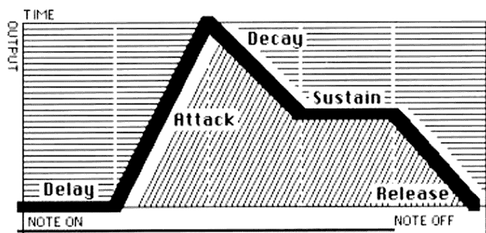

**SINGLE-MULTI** / In SINGLE mode, the envelope gets a new gate signal only if not already gated (that is, playing). Slurring notes will not generate new gates.

In MULTI mode, the envelope gets a new gate whenever there is a new note. Slurred notes will generate new gates in multi mode. When combined with the RESET mode above, the envelope will start at zero on every note, no matter how it is played.

**EXTRIG** / This triggers the envelope from the External Trigger Input on the rear panel, which enables the envelope to be synchronized to external clocking sources. This is especially effective used with the CLICK OUT of the DMX or DX Drum Machines.

**LFOTRIG** / This enables one of the LFOs to trigger the envelope, to synchronize it with other modulation functions of the Xpander. When LFOTRIG is underlined, the adjacent display shows which LFO (including the vibrato LFO on the VIB Multi Patch page) is being used as the trigger.

**GATED** / If either EXTRIG or LFOTRIG is on, the GATED switch appears. If the GATED display is underlined, the External trigger or LFO trigger source will trigger the envelope only if the envelope is gated. In other words, it will trigger only when a note is being played. If GATED is off, the envelope will continually trigger.

#### Creating Very Long or Unusual Envelopes

Remember that unlike all your other synths, you can modulate all of these timings with anything — an LFO, the velocity, the keyboard (especially through a tracking generator), or even another envelope. For example, modulating the Release with the envelope's own output results in a release time that gets faster and faster as it nears the zero level, something like 75 minutes later. Setting all of the Envelope times to 63, modulating each of them with a Tracking Generator set to 63, and switching on Freerun & DADR, results in an envelope cycle that runs about half an hour in length from just a quick touch on the keyboard. Trance, anyone?

Oh yes, the VCA (like all VCAs) can be modulated, too.

#### Stopping An Envelope

Pressing the TUNE PAGE button will cut short any envelopes in progress, if you don't wish to hang around for the above mentioned half hour envelope to finish its cycle.

```changelog
30:3 | "This has the same as if you stopped playing" -> "This has the same [effect] as if you stopped playing" | confidence medium ([?effect?] non visible tel quel sur l'image, mot manquant reconstruit par grammaire — sens non affecte)
31:3 | "If GATED is oft" -> "If GATED is off" | confidence high
```

### LFO X

*(page-0033.png, p.32 imprimée)*

There are also up to five LFOs or Low Frequency Oscillators on each voice. LFOs are used for continuous cyclical modulations like vibrato, tremolo, phasing, and chorusing, to name just a few. Having five LFOs permits unprecedented complexities in the timbre of a sound.

#### Selecting an LFO

Pressing the LFO X button will show the display.

Pressing an X SELECT button from 1 to 5 will select that LFO, or pressing the LFO X button will select the LFO that was selected previously.

You can switch between LFOs with the X SELECT buttons, if none of the values on the lower display are underlined.

#### LFO Controls

**SPEED / WAVE / RETRIG / AMP**

**SPEED** / This controls the frequency of the LFO. Set to 0, an LFO takes 30 seconds to complete one cycle. Set to 63, the speed is approximately 25Hz.

**WAVEFORM** / Selects the waveshape of the LFO.

**RETRIG** / The LFO can be set to restart at a programmable point in its cycle whenever a trigger is received. This control sets the restart point (0-63). If the RETRIG MODE is not turned on from Page 2, then this control is OFF.

**AMP** / The output level of the LFO.

The speed and amplitude can be modulated (see Modulation Pages).

*(page-0034.png, p.33 imprimée)*

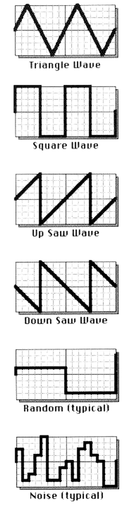

Waveforms: **TRIANGLE** — This is the most common LFO waveform, a smooth up and down, perfect for conventional vibrato and tremolo.

**UP SAW** — The up sawtooth is useful for special effects; the sawtooth can make the pitch of an oscillator go up repeatedly, or a VCA get loud.

**DOWN SAW** — The down sawtooth goes in the opposite direction from the up saw. This is useful for echo effects, patched up to one of the VCAs on the VCF/VCA page.

**SQUARE** — The square wave alternates between high and low. Good for trills.

**RANDOM** — This waveform outputs a random signal, sometimes called sample and hold. Random used to modulate the filter frequency or oscillator pulse width makes a good rhythmic effect when triggered externally (see LFO Page 2) and clocked by a drum machine or sequencer.

**NOISE** — Just what it sounds like, noise. A high speed version of random. This is good in small doses for adding a bit of instability to oscillators, or in large amounts for buzzing bees.

**SAMPLE** — The Xpander can sample another source and use that as a waveform. The SPEED controls how often the source is sampled. The SAMPLE control appears to select the sampled source, which can be any of the modulation sources.

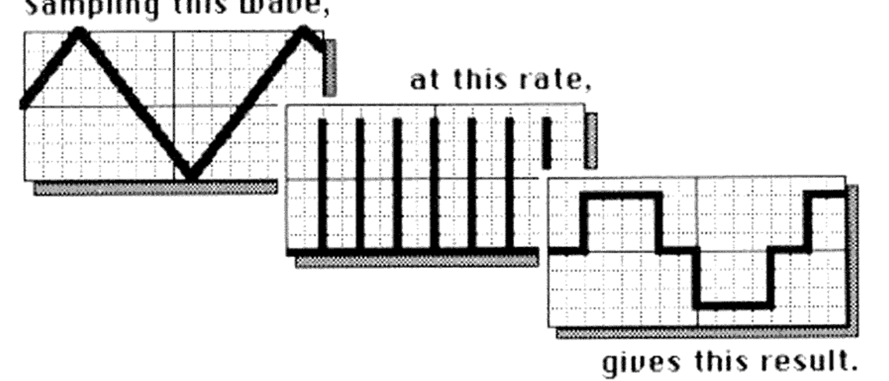

#### Page 2

**LAG** / Each LFO has its own fixed-time lag processor. Turning on lag will smooth out any sharp transitions, like those in a square or sawtooth wave. (If you need greater lag control, you can always run the LFO through the separate Lag Processor.)

**RETRIG MODE** / The LFO can be set to restart at a programmable point in its cycle whenever a trigger is received. This control turns the retrig function on and selects the trigger source: keyboard (single or multi trigger modes) or the External Trigger Input. The RETRIG control on Page 1 sets the retrig point.

#### Modulating the LFO

The speed can be modulated by accessing its Modulation Page (press the SPEED button). Recommended modulation sources are the keyboard so that the speed changes depending on the note played, Velocity so that the speed changes depending upon how hard the note is played, or one of the envelopes so that the speed changes as the note plays. Of course there are many other interesting modulation combinations, like modulating an LFO with itself, so that it changes speed in the course of its cycle. See the Modulation Page Section for more [details].

```changelog
33:1 | page nette, aucune correction significative | confidence high
34:2 | "Good for trills" (fin de phrase reconstruite, coupure de page dans l'OCR brut) | confidence high
34:3 | "See the Modulation Page Section for more" -> "...for more [details]." | confidence medium (fin de page coupee, mot exact non confirme visuellement)
```

### TRACK X

*(page-0035.png, p.34 imprimée)*

The Tracking Generators are another of the Xpander's unique features. These enable rescaling of any control source to your personal needs; having the filter open up a bit more in the middle range of the keyboard, for example.

#### Selecting a Tracking Generator

Pressing the TRACK X button will show the display:

**SELECT TRACKING GEN FROM 1 TO 3**

Pressing an X SELECT button from 1 to 3 will select that Tracking Generator, or pressing the TRACK X button again will select the Tracking Generator that was selected previously.

You can switch between Tracking Generators with the X SELECT buttons, if none of the lower display functions are underlined.

#### Operation

A Tracking Generator divides the control range into five sections. At each of these points, you can define the desired output.

*(page-0036.png, p.35 imprimée)*

The Tracking Generators work in two different ways, depending upon the original source:

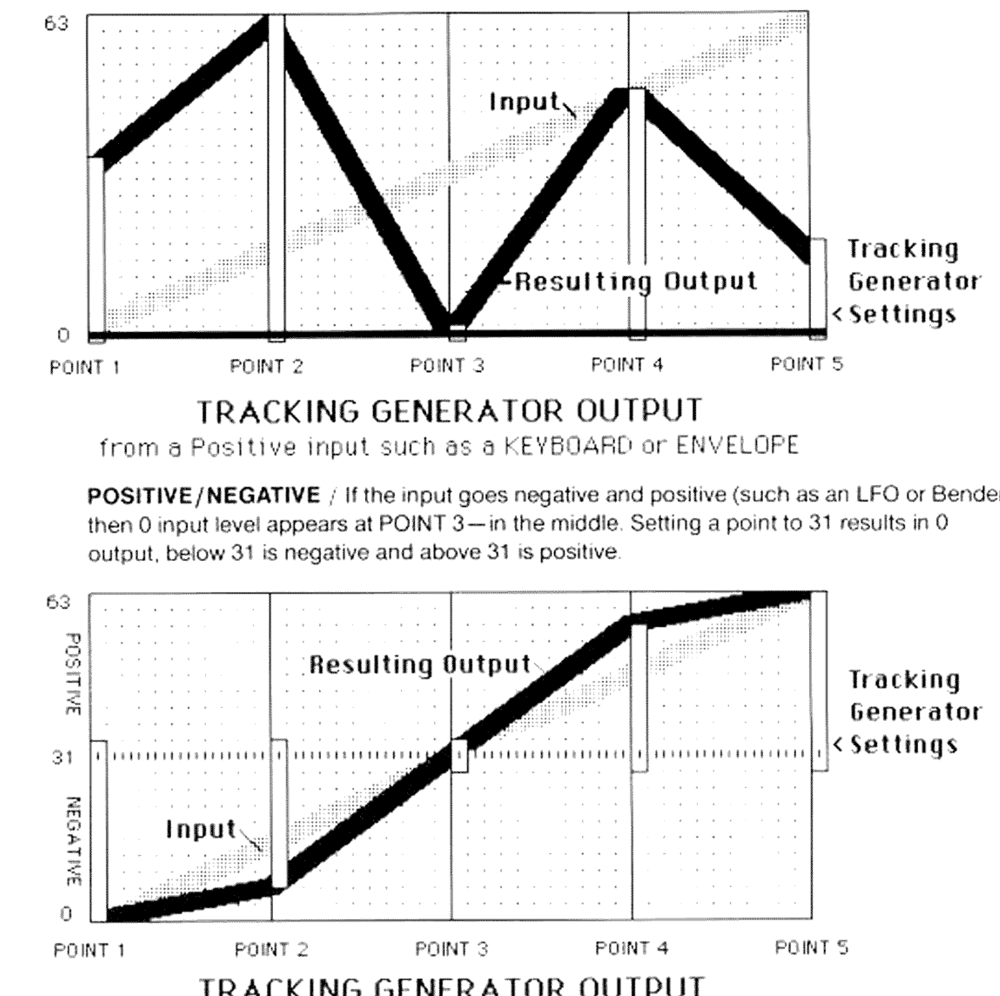

**POSITIVE ONLY** / If the input goes from 0 to 63 (such as keyboard or envelope) the 0 input level appears at POINT 1. Setting the output to 0 results in 0.

**POSITIVE/NEGATIVE** / If the input goes negative and positive (such as an LFO or Bender) then 0 input level appears at POINT 3 — in the middle. Setting a point to 31 results in 0 output; below 31 is negative and above 31 is positive.

#### Ideas

Two hip things that can be done with Tracking Generators are:

1) With a Triangle wave from an LFO (input) as an input, setting Points 2 and 4 towards the extremes will result in an output closer to a sine wave.

2) A variable control such as a Pedal or Velocity (positive inputs) can be turned into a switch with a Tracking Generator, by setting all of the points to 0 except the highest one. Only near the maximum input will anything other than 0 come out of the Tracking Generator. You can patch the Pedal somewhere else in addition to the Tracking Generator, giving you gradual control of one function with the full range of the pedal, while switching on a second function only at the top of the pedal.

```changelog
35:1 | page nette | confidence high
36:1 | reconstruction des deux légendes de graphe depuis l'image (OCR: "rrom a input such as an or BENDER") | confidence high
```

### RAMP X

*(page-0037.png, p.36 imprimée)*

There are up to four Ramp Generators on each voice. Ramps are similar to the attack portion of Envelopes: when triggered they generate a control signal from 0 to 63, in the amount of time set by the RATE control, up to 30 seconds.

#### Selecting a Ramp

Pressing the RAMP X button will show the display:

**SELECT RAMP FROM 1 TO 4**

Pressing an X SELECT button from 1 to 4 will select that Ramp, or pressing the RAMP X button again will select the Ramp that was selected previously.

You can switch between Ramps with the X SELECT buttons, if none of the lower display functions are underlined.

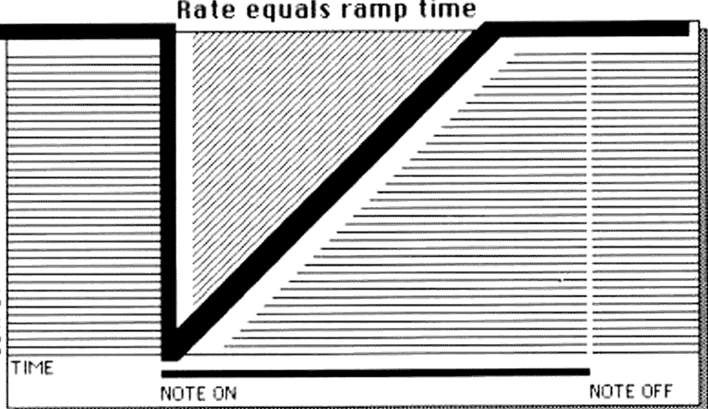

#### Operation

Not much to operate on page 1 of a Ramp, just the RAMP RATE. However, the Ramps can operate in several modes which are on page 2. These are the same options as for envelopes.

*(page-0038.png, p.37 imprimée)*

**MULTI / EXTRIG / VIB / GATED**

**SINGLE-MULTI** / In single mode, the Ramp gets a new gate signal only if not already gated (that is, already playing). Slurring notes will not generate new gates.

In multi mode, the Ramp gets a new gate whenever there is a new note. Slurred notes will generate new gates in multi mode.

**EXTRIG** / This triggers the Ramp from the External Trigger Input on the rear panel, which enables the Ramp to be synchronized to external clocking sources. This is especially effective used with the CLICK OUT of the DMX or DX Drum Machines.

**LFOTRIG** / This enables one of the LFOs to trigger the Ramp, to synchronize it with other modulation functions of the Xpander. When LFOTRIG is underlined, the adjacent display shows which LFO (including the vibrato LFO on the VIB Multi Patch page) is being used as the trigger.

**GATED** / If either EXTRIG or LFOTRIG is on, the GATED switch appears. If the GATED display is underlined, the External trigger or LFO trigger source will trigger the Ramp only if the Ramp is gated. In other words, it will trigger only when a note is being played. Otherwise, the Ramp will continually trigger.

### MISC

The Misc page sets the name of the Single Patch. Press the button below NAME.

#### Naming Patches

There are two controls for naming a patch:

**CHARACTER** sets which character is selected.

**CURSOR** sets where the character goes. The flashing cursor in the display shows the current location.

The available characters include English numbers and letters, as well as quotes, brackets and other symbols.

```changelog
37:1 | page nette | confidence high
38:1 | "This triggers the Ramp f the Ramp is gated" -> "...will trigger the Ramp only if the Ramp is gated" | confidence high
```

### Modulation Pages

*(page-0039.png, p.38 imprimée)*

#### Possible Modulation Sources

A Modulation Page exists behind every function that can be modulated. The Modulation Pages are shown in green on the block diagram. To access a particular Modulation Page, press the button of the function you wish to modulate (notice the "Modulation Page Select" LED to the left of the buttons). For example, on the VCF/VCA page, touch the FREQ button to modulate the filter frequency, touch RES to modulate the filter resonance, or touch VCA1 or VCA2 to modulate the volume of the VCAs. To return to the primary page, touch the PAGE 2 button, or touch any of the page select buttons to go to another page.

When a function is being modulated, a dot will appear in the display next to the function's name.

Any of the devices labelled in the Modulation Source section can be used as a modulation source. These are:

LEVER 1 is usually a MIDI pitch bend lever or wheel.

LEVER 2 is usually a MIDI vibrato lever or wheel (not the vibrato itself — that's VIB). PEDAL 1 is usually the Xpander's Pedal 1 input.

PEDAL 2 is usually the Xpander's Pedal 2 input.

VIB is the output of the VIB Multi Patch page.

KEYBOARD is whatever is designated as the controller for each voice: CV, MIDI Channel, or Zone.

LAG is the output of the Lag Processor. VELOCITY is the MIDI attack velocity signal (how fast you press down on the keys). RELEASE VELOCITY is the MIDI release velocity signal (how fast you let go).

PRESSURE is usually the MIDI after-touch pressure signal (how hard you press on the keys while holding them down).

ENV X will assign an Envelope Generator as an input. The display will prompt you for which one.

LFO X will assign an LFO as an input. The display will prompt you for which one.

TRACK X will assign a Tracking Generator as an input. The display will prompt you for which one.

RAMP X will assign a Ramp Generator as an input. The display will prompt you for which one.

Exactly where the levers, pedals, and pressure come from is set on the MIDI Controls page in the Master Section.

*(page-0040.png, p.39 imprimée)*

#### Selecting Modulation

##### Adding a Modulation Source

There can be six modulation sources at one time to each destination, one above each of the six Page Modifier buttons. Choose the desired source in the Modulation Source section (flashing LED). The name of the selected modulation source will appear on the display above.

Remember that if you have selected an LFO, Envelope, Tracking Generator, or Ramp as a modulation source, the X SELECT LED will prompt you to choose which one.

The amount of modulation is selected by the knob below the name of the source on the display, or by pressing the button above the knob (Value X) and typing in a value (or + and -) with the X SELECT buttons. Pressing the CLEAR button will set the amount of modulation to zero.

##### Changing a Modulation Source

To change a modulation source, touch the button underneath the source that you wish to change. That source will become underlined, and you can now press one of the Modulation Source buttons to change it.

##### Removing a Modulation Source

To remove a modulation source, touch and hold the button underneath the source that you wish to delete. That source will become underlined. While holding the button, press the CLEAR button in the Modulation Source section, and poof! the modulation will disappear.

#### Options

##### Quantized Modulation

Different effects can be achieved by Quantizing the modulation. Quantizing causes semitone steps instead of a smooth change of an Envelope, LFO, Lever, or other modulation.

To quantize a modulation, press the button under the appropriate amount display (Value X) and press the QUANTIZE button in the X Select section. A [?symbole?] will appear in the display to indicate quantization.

##### Positive/Negative Modulation

Modulation sources can be set to add (+) or subtract (−) from the initial value.

##### Multiple Modulation

A modulation source can be directed to a particular destination more than once for more range, for example to bend notes farther than the minor sixth normally possible with MIDI Lever 1 (see MIDI Controls in the Master Page section for more details on this particular application.)

Note that the control of the modulation amount is exponential, so the numbers don't exactly add up. The higher the number, the larger the amount of change. This enables one control to be used for a coarse range (large numbers) and an additional control used for a fine range (small numbers).

*(page-0041.png, p.40 imprimée)*

##### Modulation Limitation

There aren't many limits to your options in the Xpander, but you should be aware that there can be no more than 20 modulations on each voice at one time. The Xpander's computers simply can't do any more and keep up. (We've put twice the computing power of an IBM PC inside the Xpander, but even so it can only count so fast!)

You will need to remove some modulations before you can add any more.

Note that this limitation only applies to modulations on Modulation Pages; modulation sources on Page 2 of the VCOs and VCF are not counted. Therefore you should use the Page 2 modulations for control by the Keyboard, Lag, Vibrato, or Pitch Bend whenever possible.

Unused modulations can be spotted by watching for the modulation dots next to function names in the display.

```changelog
39:1 | "you wish to modulate" reconstitue depuis "notice the Modulation Page Select LED" (texte clair sur image) | confidence high
40:1 | "touch the button underneath the source that you which to change/delete" -> "wish" (x2) | confidence high
40:2 | "A will appear in the display to indicate quantization" -> "A [Q] will appear..." | confidence medium ([?Q?] non confirme visuellement, symbole d'affichage probable non lisible sur le scan)
41:1 | "mogulat:on sources on f2age 2... are not counted Theretare you should use the Page 2 lations" -> reconstruction complete du paragraphe depuis le sens et les fragments lisibles | confidence medium
```


---

## Putting It All Together

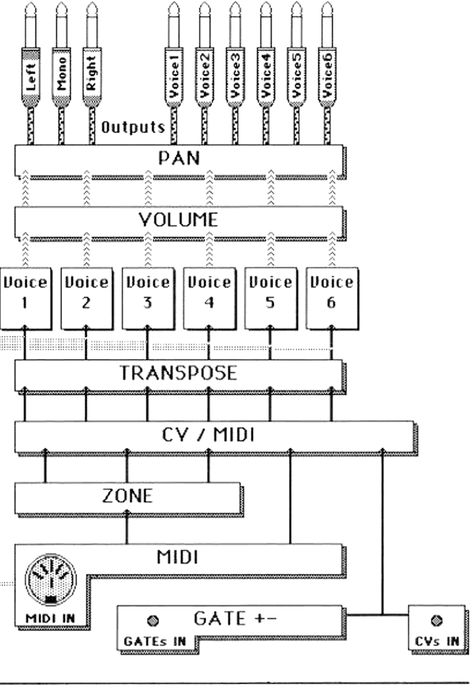

*(page-0042.png, planche pleine page sans folio — ouverture de chapitre)*

*(page-0043.png, p.43 imprimée — page d'ouverture "Putting It All Together / Multi Patches", avec index visuel du chapitre)*

Index des sections de ce chapitre (tel qu'imprimé sur la page d'ouverture) :

- **44** Multi Patch Pages — VOLUME, PAN, TRANSPOSE, VIB (Controls, Page 2), CV/MIDI, ZONES (Input, Limit, Mode, Splits Doubles and Triples), MISC (Naming Patches)
- **49** Master Pages — MASTER MULTI PAGES, CHAIN (Control Functions), MIDI (Channel, Controls, Enables, Send, Reset, Mute), GATE +/-, CASS, SERVICE PAGES (Voices On/Off, Service, Version)

### Multi Patch Pages

*(page-0044.png, p.44 imprimée)*

There are six Multi Patch pages, shown in grey on the right side of the front panel. The desired page is accessed by pressing the page select button next to the name of the desired page, while in Multi Patch mode.

When a Multi Patch Page is selected, the LED next to the button in the block diagram will light and the name of the page will also appear on the "current page" section of the Programmer display. The functions associated with this page are displayed on the Page Modifier displays.

#### VOLUME

The VOLUME page is the "mixer" of the Xpander. On this page, each voice has a volume control (0-63) so that the balance between the voices can be adjusted and programmed into a Multi Patch.

#### PAN

This page sets the placement of each voice to the stereo mixed outputs or to the individual outputs. A voice can be panned to one of seven positions within the stereo spread or to its own individual output.

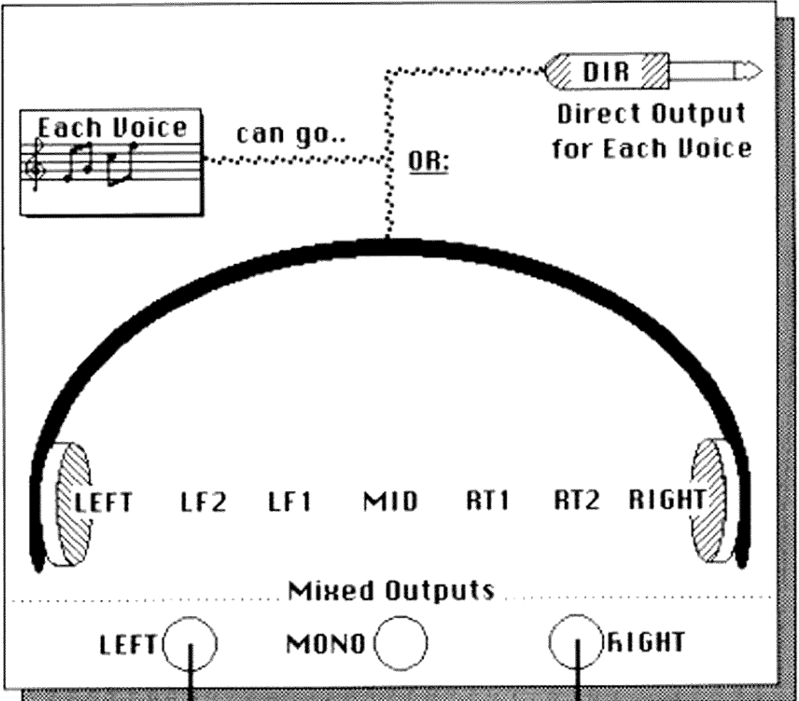

Note that a voice cannot be sent to the mixed outputs and its own individual output at the same time.

*(page-0045.png, p.45 imprimée)*

#### TRANSPOSE

This page controls the relative pitch of each voice within a Multi Patch. Each voice can be transposed up (+) or down (−) up to two octaves. Each step equals a semitone. This equals twelve steps per octave.

#### VIB

The VIBrato page contains one LFO that can be used for all of the voices; for vibrato, tremolo, and other effects.

##### Controls

**SPEED / WAVE ... AMP**

**48 TRIANGLE ... 63**

**SPEED** / This controls the frequency of the LFO. Set to 0, the LFO takes 30 seconds to complete one cycle. Set to 63 the speed is about 25Hz.

**WAVEFORM** / Selects the waveshape of the LFO. The waveforms are the same as on the other LFOs, minus the sampling capability.

**AMP** / The output level of the LFO.

*(page-0046.png, p.46 imprimée)*

##### Page 2

**LAG**

**SPEED=PED 2 ... AMP=LEV 2**

**LAG/VIB** has its own fixed-time lag processor. Turning on lag will smooth out any sharp transitions like those in a square or sawtooth wave. (If you need greater lag control, you can always run it through the separate Lag Processor.)

**SPEED and AMP** / The speed and amplitude of the vibrato LFO can be modulated by Lever 2 or Pedal 2. These controls replace the usual Modulation Pages. Turn the first control to select the Modulation Source, the second to set the amount.

#### CV/MIDI

The CV/MIDI page selects the control source for each voice. Each Xpander voice can be controlled independently (monophonically) from each CV Input or MIDI Channel. Several voices can be assigned to each Zone to play polyphonically. The control for each voice selects ZONES 1-3, CVS 1-6, or MIDI 1-16.

If you are using the CVs as a controller for the Xpander, and notes in the high register are off by a semitone, or they "flicker" between notes, calibration of the Control Voltages is necessary, either on the controller (like a DSX) or if necessary, on the Xpander. Contact your nearest Authorized Oberheim Service Center for this non-warranty adjustment.

Note: Older analog keyboards may not be fast enough or stable enough to operate the Xpander properly, and double triggers or lag may result. Turning on CV DEBOUNCE, on Page 2 of the Gate +/− Master Page may eliminate this problem.

*(page-0047.png, p.47 imprimée)*

#### ZONES

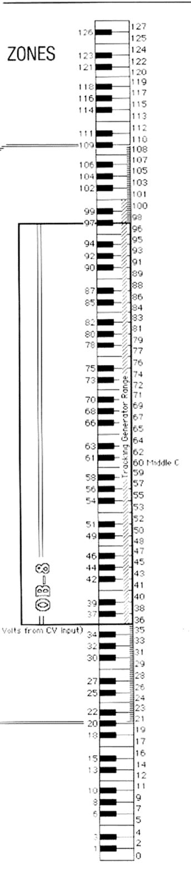

The three Zones are very important because they enable the Xpander to play chords as a six voice synthesizer, rather than as six one-voice synthesizers. Zones operate in conjunction with a MIDI control source. There are three attributes to each Zone, each on its own subpage:

##### Input

This specifies the control source, either one of the MIDI channels (1-16) or Omni Mode, which is all MIDI channels.

##### Limit

This specifies the range of notes that the zone will receive. The upper and lower limits can be programmed by holding the button under the desired Limit and then playing a note on a MIDI controller. Zone limits can also be set by turning the appropriate control. The display shows the MIDI note number, 0-127 (ten octaves). The accompanying chart shows the keyboard equivalent of each note number, with ranges of a piano and an OB-8 in comparison.

##### Mode

This specifies the process for assigning voices. **Rotate** gives every new note to a new voice, as with an OB-8.

**Reassign** mode is similar to Rotate, except that notes with the same pitch get reassigned to the same voice, as with a Prophet 5 or Oberheim Modular 4-Voice.

**Reset** is another scheme from the 4-Voice: the first note played will always go to the lowest number voice assigned to the zone, Voice 1. The second note played will always go to the second voice in the zone, etc.

**Uni-High, Uni-Low, & Uni-Last** are unison modes with highest, lowest, or last note priority, respectively. Uni-Low is the unison mode of an OB-8.

##### Splits, Doubles, and Triples

Each Zone can have different limits, which can be used to split a keyboard or other controller into three independent parts. The split zones have the unique capability of being able to overlap, if desired.

When zones overlap, each note will be played by each zone, enabling two or three voices to sound with each note played. Also, since each zone interprets the notes independently, it is possible to have one zone in unison while another zone plays the same notes polyphonically, or a double on one half of a split keyboard, or...

Are you starting to realize the fantasy of this machine?

*(page-0048.png, p.48 imprimée)*

#### MISC

The MISC page sets the name of the Multi Patch, the same as it does in Single Patch mode. Press the NAME button to access the name function.

##### Naming Patches

There are two controls for naming a patch:

**CHARACTER** sets which character is selected.

**CURSOR** sets where the character goes. The flashing cursor in the display shows the current location.

The available characters include English numbers and letters, as well as quotes, brackets and other symbols.

The Misc page will have other functions as the Xpander software evolves.

```changelog
44:1 | "the placement of each voice to the stereo mixed outputs" reconstruit avec le schema PAN a l'appui | confidence high
46:1 | "the Control is necessary, on the (ike a DSX)" -> "calibration of the Control Voltages is necessary, either on the controller (like a DSX)" | confidence high
46:2 | "Turring on CV DEBOUNCEL... Gate + — Masler Page" -> "Turning on CV DEBOUNCE... Gate +/− Master Page" | confidence high
47:1 | page nette (contenu confirme depuis l'image en detail) | confidence high
```

### Master Page

*(page-0049.png, p.49 imprimée)*

The Master Page accesses functions that are not remembered as part of a patch, but are used globally (that is, in all modes) by the Xpander.

There are two sets of pages displayed. In the upper display are pages that affect the Xpander in both Single and Multi Patch modes. On the lower display are pages that will appear only while in Single Patch mode. These are the Master Multi Pages.

#### Master Multi Pages

Even while playing a Single Patch, you need to be able to select MIDI channels, vibrato, volume, pan, etc., all of the parameters normally part of a Multi Patch. So, there is an extra Multi Patch just to play Single Patches.

This Master Multi Patch has the exact same pages as a regular Multi Patch, except for the TRANSposition page that is preset to -12 (an octave lower.) The settings are not stored in a particular program location, but are remembered as a global setting for the machine. These settings are stored on tape and can be loaded separately by selecting "LOAD GLOBAL." (See Cassette Interface.)

Refer to the specific Multi Patch Page for more information (see Multi Patch Section.)

#### Chain

Chain is a scheme that enables a series of Single and Multi Patches to be accessed in programmed succession. This allows you to jump directly from one particular Single or Multi Patch to another, especially useful in live performance. There are 100 steps within the Chain.

The Chain can be advanced from the Advance Chain Input on the rear panel, from the Programmer Keypad, or with the STEP control on the Chain Page.

##### Control Functions

**ENABLE** turns chain mode on and off. When ENABLE is off, the Programmer Keypad operates normally. (Triggers to the Advance Chain Input have the same effect as pressing the "+" on the keypad.) When ENABLE is ON, the Advance Chain Input as well as "+" and "−" on the Programmer Keypad will select steps in the chain. You can still select a patch not in the chain by entering its number directly on the keypad. A third mode, SLAVE, ties the programmer to the STEP control.

**STEP** selects the desired chain step, 0 through 99. **MODE & PATCH** select the desired Single or Multi Patch program for that step.

#### MIDI

MIDI on the Xpander sets new standards for interface flexibility. The Xpander can be controlled from several MIDI channels at once, with complete independence for each voice if desired.

##### Channel

This selects the basic MIDI channel, used to address the machine as a whole. The basic channel is used for a few Xpander functions, such as PEDAL2 and LEVER2, patch changes, and for converting CVs IN to MIDI OUT. The CV/MIDI and Zone pages are used for most MIDI channel selections on the Xpander.

*(page-0050.png, p.50 imprimée)*

##### Controls

This page selects the source of each controller. The "PEDAL1" control that appears as a modulation source throughout the Xpander pages does not have to be the Pedal 1 Input on the rear panel. PEDAL1 can come from a pedal connected to another synthesizer, for example. This page is how you select where it comes from.

Besides the dedicated Lever and Pressure (Pressr) controls, there are 122 other possible controller inputs on MIDI. You select the desired input with the knobs. A table of common MIDI controllers is in the Appendix of this manual.

Realize that the number above the control is not how much modulation, but the MIDI controller number.

A subtle difference exists between the Lever & Pedal 1 and the Lever & Pedal 2. Lever 2 and Pedal 2 are *universal* controllers: there is one of each for the entire Xpander. Lever 1 and Pedal 1 exist *independently* for each voice, so that you can bend each voice separately from a MIDI guitar controller equipped with bend for each string, for example.

Lever 1's range is normally a major second when enabled using the on/off switch found on Page 2 of the oscillators and filter. Wider range can be achieved by selecting Lever1 on the Modulation Page. Semitone intervals correspond to the following amounts:

min 2 = 46; Maj 2 = 53; min 3 = 56; Maj 3 = 58; Per 4 = 60; dim 5 = 61; Per 5 = 62; min 6 = 63

Even wider range can be achieved by modulating the frequency with Lever1 twice. For example, an octave bend is created by setting one modulation amount to a min 6 (63), and a second to a Maj 3 (58) to equal an octave.

##### Enables

This page contains most of the MIDI options. SYSTEMX, CONTROL, and PATCH must be enabled on both the master and slave machines to operate.

**SYSTEMXclusive** enables complete control of another Xpander: page selects, editing — in other words everything that you do on one Xpander will be mimicked by a slave Xpander. SYSTEMX must be on to send patches across MIDI (see below.)

**XMITCV** transmits Control Voltage and Gate Inputs to the MIDI OUT. See "CV POLY-CV MONO," below.

**ECHO** adds the Xpander's own MIDI information (patch changes, system exclusive, etc.) to the information coming in on MIDI, and sends it to the MIDI OUT. When ECHO is on, MIDI OUT isn't much different than MIDI THRU, but is better for operating several Xpanders from one controller.

**CONTROL** turns on the MIDI Levers and Pedals. See "Controls," above. The Xpander's own Pedal Inputs are not affected.

**PATCH** turns on MIDI patch changes.

*(page-0051.png, p.51 imprimée)*

**VELOCITY** sets the Xpander's response to MIDI velocity information. Linear response causes the velocity to respond linearly: the output is twice as much when you play twice as hard. Expo 1 makes the response exponential, just as the ear hears: you play twice as hard, and the output is ten times more. Expo 2 is also exponential, but the response is compressed to achieve a more useful range.

**CV POLY-CV MONO** sets the mode for transmitting CVs out MIDI (see XMITCV, above). CV POLY sends all six voices to the basic MIDI channel, polyphonically. CV MONO sends each CV to its own channel: CV1 goes to the basic channel, CV2 to the basic channel plus one, CV3 to the basic channel plus two, etc.

**DEFAULTS ON** sets the Xpander to the default MIDI setting when power is turned on. NO DEFAULTS leaves the MIDI settings as they were.

The MIDI default condition is:

| Paramètre | Valeur par défaut |
|---|---|
| Basic Channel | 1 |
| Omni Mode | ON (all zones play all notes on all channels) |
| System Exclusive | OFF |
| Transmit CV | OFF |
| Echo | OFF |
| Controls | OFF |
| Patch Changes | OFF |
| Velocity | EXPO 1 |
| CV Mode | POLY |
| Defaults | ON |
| Lever 1 | MIDI BENDER |
| Lever 2 | 1 (Vibrato) |
| Pedal 1 | PEDAL 1 (on Rear Panel) |
| Pedal 2 | PEDAL 2 (on Rear Panel) |
| Pressr | MIDI PRESSURE |

##### Send

You can send an actual patch (not just its number) to another Xpander from this page. This will send the currently underlined Single or Multi Patch in its edited state. Select the destination patch number of your choice and press SEND.

SYSTEMX must be on for SEND to work (see above) and a patch cannot be sent if several patches are being edited simultaneously.

##### Reset

Pressing RESET sends an all notes off command and resets MIDI to the default setting. "You Sure?" Touch YES to execute, NO to exit.

##### Mute

This turns off notes that have been left on accidentally. Once a voice gets a "note on" command from MIDI, it stays on until it receives a "note off" command. There are any number of reasons why a note off command would not be received (disconnecting your MIDI cable, for example), so the mute button provides a way to manually turn off notes.

For more information about MIDI, refer to the OBERHEIM XPANDER MIDI SPECIFICATION document.

*(page-0052.png, p.52 imprimée)*

#### GATE +/−

This page sets the polarity of the Gate inputs on the rear panel: "+" gives a gate when the signal "goes high" (standard setting), "−" sends a gate when the signal goes low (Moog "V-Trig" setting).

Press Page 2 to set the polarity of the External Trigger Input. When using an Oberheim footswitch as a trigger source, set the polarity to "−". Page 2 also turns on CV DEBOUNCE, useful when controlling the Xpander from an analog keyboard via CVs.

#### CASS

This accesses the Cassette Interface, for off-line patch storage. See the section on Cassette Interface, below.

#### Service Pages

Pressing the Page 2 button accesses additional pages for servicing and other technical information.

##### Voices On/Off

Each voice can be turned on or off from this page. This is useful if you want to use fewer voices for some reason, or if the tuning process turns off (FAILS) some of the voices.

##### Service

The Xpander contains many diagnostic routines to aid in calibration and troubleshooting by technicians. For more information about these service aids, refer to the OBERHEIM XPANDER SERVICE GUIDE.

##### Version

This reveals the various software versions currently in your Xpander.

**Main Processor Software** is the software that operates the buttons, knobs, displays, etc.

**Voice** is the software that operates the voice itself: the LFOs, Envelopes, etc.

**Cassette** is the software that operates the cassette interface.

```changelog
49:1 | "selecting GLOBAL" (See Cassette Interface.)" -> "selecting "LOAD GLOBAL." (See Cassette Interface.)" | confidence medium
50:1 | reconstruction du tableau des intervalles Lever1 (OCR: "min 2 = 46 mint = B3" tres degrade) depuis l'image | confidence high
50:2 | "bend each voice trom a MID controler equipped with bend tor each string" -> "bend each voice separately from a MIDI guitar controller equipped with bend for each string" | confidence medium
52:1 | "gives a gate when the signal "goes high" ... sends a gate when the signal goes low" -> symboles "+"/"−" restitues par coherence avec le titre de section "GATE +/−" (glyphes flous sur l'image, non desambiguises avec certitude) | confidence medium
```


---

## Save It (A Good Investment)

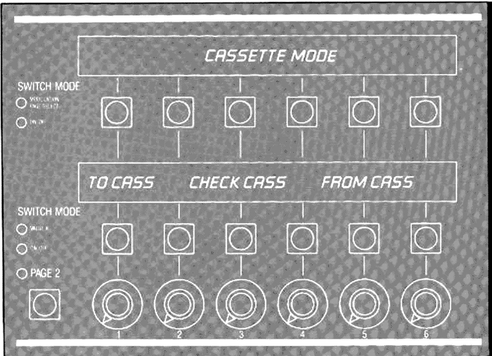

*(page-0053.png, planche pleine page sans folio — ouverture de chapitre)*

*(page-0054.png, p.55 imprimée — page d'ouverture avec index visuel du chapitre)*

Index des sections de ce chapitre (tel qu'imprimé sur la page d'ouverture) :

- **56** Learning To Love Your Cassette Interface — Hookup, Access, Save It, Check It, Loading In, Errors (Causes Of Errors, Error Messages)

### Learning To Love Your Cassette Interface

*(page-0055.png, p.56 imprimée)*

The Xpander Cassette Interface enables off-line tape storage of your patches, on any convenient tape format.

Making data tape backups of your work is something that you should do frequently, with all your [?machines?]. You'll find that keeping copies of your programs will help speed up your work and eliminate duplication of effort.

"How did I get that sound before?" No matter, if you've got it on tape. You can load it back into your Xpander (or anyone else's for that matter) and get on with it.

#### Hookup

Connect the two cassette jacks on the rear of the Xpander to any tape recorder with reasonable frequency response. TO CASSETTE goes to the recorder's input, FROM CASSETTE comes from the recorder's output. Connect both cables so that you can monitor the tape through the Xpander.

#### Access

The Cassette Interface is located on the Master Page. Press the MASTER PAGE button, and then the CASSette button.

#### Save It

Place the tape recorder in record, and monitor through the recorder. Press the TO CASS button and adjust the levels on your recorder until you hear the leader tone *through the Xpander*. The Master Volume control will adjust the monitor level (won't affect the interface.) When you hear the tone, your settings are good. (If you're not listening, set your levels to 0VU.)

Note: If it has taken you longer than ten seconds to set levels after pressing the TO CASS button, you may have missed the beginning of the data. Press the PAGE 2 button to abort the transfer, and start over again.

You will notice that the Xpander displays are completely dark except for the Page 2 LED. This is unnerving perhaps, but normal. Don't ask why. Just listen for the tone and watch the Page 2 LED blink on and off as each patch gets copied onto tape.

The enormous capabilities of the Xpander result in an enormous amount of data that needs to be stored onto tape (about three times more than an OB-8). So sit back, relax... This process takes about two minutes. When the LED starts blinking faster, the Xpander is copying the Multi Patches — and it's almost done.

You can abort the cassette process at any time by pressing the PAGE 2 button.

When the data transfer has finished, the display will say "DATA COMPLETE" and request that you press the PAGE 2 button.

Now all your patches are recorded safely on tape. Or are they? There's only one way to find out:

*(page-0056.png, p.57 imprimée)*

#### Check It

Always check a tape after recording it. There are all sorts of reasons for a tape not to work, and it's better that you find out now, while you can still make another tape if you have to.

Now that I've got your attention, I should mention that the Xpander cassette interface is more reliable and is more tolerant of bad tape and tape recorders than any interface we've ever made.

The Check process is the reverse of the Save process:

Press the CHECK CASS button on the cassette page, start the tape, and adjust the level on the recorder until you hear the leader tone through the Xpander's output. When you hear the tone, your settings are good and the cassette interface is ready to receive data. If you don't hear the tone, the Xpander doesn't hear either. The Master Volume control adjusts your monitor level, but doesn't affect the interface.

The Xpander will revert to its state of suspended animation (completely dark except for the Page 2 button and LED, which flashes as each patch gets transferred) until the data is finished, at which point the display will read either "DATA COMPLETE," or one of several error messages.

You can abort the cassette process at any time by pressing the PAGE 2 button.

#### Loading In

Load data from tape follows the same process as checking a tape, with the addition of some options. Press the FROM TAPE button to view them.

**ALL** loads all patches into the Xpander.

**ONE** patch only. Pressing ONE prompts you for the desired patch from the tape and the destination patch number into the Xpander. Press START when you're ready.

**SINGLE** loads only the Single Patches. **MULTI** loads only the Multi Patches.

**CHAIN** loads only the Program Chain. Realize that the patches themselves will not be loaded in, only the chain itself.

**GLOBAL** loads only the Master Multi pages, used in Single Patch mode.

Choose one of these options, start the tape, and adjust the level on the recorder until you hear the tone through the Xpander's output. When you hear the tone, your settings are good and the cassette interface is ready to receive data. If you don't hear the tone, the Xpander doesn't hear it, either. The Master Volume control adjusts your monitor level, but doesn't affect the interface.

The Xpander will again revert to its state of suspended animation (completely dark except for the Page 2 button and LED, which will flash as each patch gets [transferred]) until the data is finished, at which point the display will read either "DATA COMPLETE," or one of several error messages.

You can abort the cassette process at any time by pressing the PAGE 2 button.

*(page-0057.png, p.58 imprimée)*

#### Errors

The Xpander's fifth generation Cassette Interface is smart enough to compensate for wide variations in tape level, speed, and phase, within limits. If it can't read the tape properly, one of the following messages will appear on the display.

While loading from tape, the Xpander checks the cassette data for each patch to make sure it's okay. If the Xpander finds an error in the cassette data for a particular patch, it leaves the original patch in memory. This insures that all the Xpander's patches are always good (well, valid anyway.) So, many patches may load successfully, even if you get an error message.

##### Causes of Errors

*If you don't hear the tone during the data transfer:*

**The leader tone** may not have played long enough. You won't hear anything out of the Xpander unless the cassette interface *hears the leader tone before the data*.

**The level** may not be loud enough. Check your wiring and adjust the tape level until you *do* hear the tone. The Cassette Interface should work with line or microphone level inputs, and with line or speaker level outputs.

*If you hear the data during the cassette transfer, and you get a message that says "ERROR IN...," then the following conditions may have caused it:*

**Poor Tape Response**, caused by poor quality tape, or a poor tape recording, is a likely cause of frequent data problems.

**Tape Azimuth Adjustment** is probably the cause if tapes made on your recorder work well, but tapes made on other recorders don't.

**Intermittent Connections**: listen to the data, to make sure that it stays on. Check your wiring.

**Low Batteries** in your tape recorder could be a problem.

##### Error Messages

**MEMORY PROTECTED** / The MEMORY PROTECT SWITCH on the rear panel is on. You must turn it off to load a tape into the Xpander.

**ABORTED** / The cassette routine stopped before completion. Did you press the PAGE 2 button to abort?

**ERROR IN SINGLE PATCH DATA** / The cassette program found one or more errors while loading Single Patches. Since Single Patches are first on the tape, there may be errors in other parts of the data as well.

**ERROR IN MULTI PATCH DATA** / The cassette program found one or more errors while loading Multi Patches.

**ERROR IN CHAIN PATCH DATA** / The cassette program found one or more errors while loading the Program Chain.

**ERROR IN GLOBAL DATA** / The cassette program found one or more errors while loading the Global Data.

**ERROR IN PROGRAM DATA** / Error in a program loaded from tape.

*(page-0058.png, p.59 imprimée)*

**NOT AN XPANDER TAPE** / Operator error (this means you!) Only Xpander tapes can be loaded in.

**CASSETTE SPEED TOO SLOW** / Your tape is going too slow. The Xpander can read tapes with wide speed variations, so something is wrong with your tape recorder if you get this message.

**CASSETTE SPEED TOO FAST** / Your tape is going too fast. The Xpander can read tapes with wide speed variations, so perhaps your tape recorder is set to the wrong speed if you get this message.

**DATA COMPLETE** / 100 hits, 100 runs, no errors.

```changelog
55:1 | "with all your find that keeping copies" -> "with all your machines. You'll find that keeping copies" | confidence medium ([?machines?] non totalement confirme visuellement, reconstruction grammaticale)
55:2 | "load it back into your Xpander (or anyone for that matter)" -> "...or anyone else's for that matter)" | confidence medium
56:1 | "The Xpander doesn't hear either" (ellipse idiomatique conservee telle quelle, comprehensible en contexte) | confidence high
57:1 | "it's okay... always good (well, anyway.)" -> "...always good (well, valid anyway.)" | confidence medium
58:1 | page nette | confidence high
```

---

## Synthesthesia

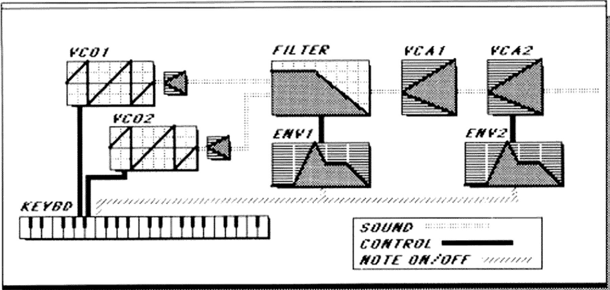

*(page-0059.png, planche pleine page sans folio — ouverture de chapitre, "Basic Patch / OBERHEIM")*

*(page-0060.png, p.61 imprimée — page d'ouverture avec index visuel du chapitre)*

Index des sections de ce chapitre (tel qu'imprimé sur la page d'ouverture) :

- **62** Basic Programming Concepts
- **62** Subtractive Synthesis
- **63** FM Synthesis
- **64** Other Considerations — Choices
- **64** Modifying The Basic Patch

### Basic Programming Concepts

*(page-0061.png, p.62 imprimée)*

This section is a brief description of synthesis techniques, designed as a starting point for realizing your own sounds.

The Xpander is capable of two primary synthesis styles.

**Subtractive** synthesis starts with complex waveforms that contain many overtones such as a sawtooth or pulse. Unwanted harmonics are removed in the synthesis process by filtering.

**FM** synthesis starts with two pure waveforms, that is waveforms that contain a fundamental frequency and few or no overtones. The overtones are created in the synthesis process by modulation.

Other synthesis methods in common use today are additive synthesis, where many pure waveforms are mixed together to create overtones; and sampling, where waveforms are recorded, and then manipulated.

### Subtractive Synthesis

Subtractive synthesis is the most common method of generating electronic sound in use today. Today subtractive synthesis is accomplished with large amounts of computer power achieving flexibility and sophistication undreamed of only a few years ago, yet the basic techniques have remained the same.

We start with an oscillator. No matter whether the oscillator is a room full of tubes or a computer program, it performs the same function: it makes the sound. Oscillators have several waveforms. These are used much like the primary colors that a painter uses.

**Sawtooth Waves** generate a fundamental frequency (the fundamental is the pitch that you hear) and harmonic overtones in a mathematical pattern: the fundamental frequency multiplied by 2, 3, 4, 5, 6, 7, 8, and so on. These harmonics create the *buzz* of the sawtooth wave. Sawtooth timbres are also generated by vibrating strings, organ pipes, and brass instruments.

**Pulse Waves** generate the same frequencies as the sawtooth except that some of the overtones are missing. A square wave, for example, is missing all the even numbered harmonics. Changing the Pulse Width changes *which* overtones are missing. Pulse timbres are created by woodwind instruments: square waves for single reeds, narrow waves for double reeds.

**Triangle Waves** generate the fundamental and only a few soft harmonics. Usually, the triangle functions the same as a sine wave. Triangle waves are generally used to emphasize particular harmonics in conjunction with saw or pulse waves.

**Sine Waves** generate the fundamental and *no* overtones at all. The Xpander's filter will generate a sine wave if the resonance is set to 63.

Unwanted harmonics are then removed by filtering. Dynamic control of the filter is crucial for flexible synthesis. That is why envelopes, LFOs and other devices are used to control the filter over time.

```changelog
61:1 | "Subtractive synthesis starts with complex waveforms" (mot "complex" manquant dans l'OCR brut, restitue depuis l'image) | confidence high
62:1 | "Square Wave... narrow waves for double reeds" reconstruit sans perte de sens | confidence high
```

### FM Synthesis

*(page-0062.png, p.63 imprimée)*

Frequency Modulation, or FM, is a basic analog concept. The evolution of Linear FM as a technique for sound synthesis has become possible in recent years because of major breakthroughs in digital signal processing and oscillator stability.

The fundamental idea of FM is that if you take two oscillators and modulate the first (called the carrier) with the second (called the modulator), a series of overtones related to the frequency and amplitude of the modulation will be generated. The electronic configuration needed to accomplish this is quite simple. One oscillator modulates the frequency of a second oscillator. Period. The trick is using linear, rather than exponential control, and being able to precisely control the modulation.

#### Terms of Modulation

In the Xpander, VCO2 is used to modulate VCO1. VCO1 is called the **Carrier**. VCO2 is called the **Modulator**.

Use a Triangle waveform on VCO1. Turn off all the waveforms of VCO2. Its triangle wave is patched separately for FM.

Access the FM/LAG page and turn up the FM AMPlitude. Then go to the VCO2 page and play with the FREQuency control. What you should hear are some of the *rudest* sounds ever to come out of a synthesizer.

#### Subtlety

With a small modulation amplitude, the overtones generated will be the frequencies of the two oscillators as well as the sum and the difference of those two frequencies. With increasing amplitudes, other overtones will be generated as well.

More of these mostly non-harmonic overtones will be generated if the modulating frequency is lower than the carrier. The lower the modulator, the more spread out these overtones become.

Changing the modulation depth (amplitude) changes the volume and number of the overtones, not unlike filtering. The depth can itself be modulated by any modulating source on the Xpander: Envelopes, Levers, Velocity, etc.; routed directly or through VCAs, Tracking Generators, or the Lag Processor.

The VCF instead of VCO1 can be used as the carrier, for other timbral variations. Set the filter resonance to 63 so that the filter will oscillate.

#### Mathematics

If the frequencies of the two oscillators are not in an exact ratio, some wonderfully noisy sounds can be generated. But because natural harmonics are in exact mathematical ratios, in-tune harmonics will result only when the carrier and modulator oscillators are in basic exact frequency ratios (unison, octaves, fifths, etc.).

```changelog
62:2 | "Access the page and turn up" -> "Access the FM/LAG page and turn up" | confidence high
```

### Other Considerations

*(page-0063.png, p.64 imprimée)*

With all styles of synthesis, other aspects of the sound are important besides the timbre. These include the attack and decay of various parameters of the sound, as controlled by the envelopes; and the addition of vibrato controlled with LFOs, etc.

#### Choices

Some timbres are easily generated with FM synthesis, especially ones that have non-harmonic tones such as bells, or have an initial attack that would be generated by plucking or striking — pizzicato strings for example.

Other timbres such as bowed strings, brass, and woodwinds may be generated more easily with subtractive synthesis. The Xpander gives you both types of synthesis techniques, which can be combined for even more interesting results.

Experiment! You'll never know what you'll discover.

### Modifying The Basic Patch

The Basic Patch (called "OBERHEIM") that is stored in the Xpander's memory can [be] recalled by holding STORE and touching CLEAR. A block diagram of this patch is shown at the beginning of this section. Looking at this diagram you can see the two Oscillators (VCO1 & VCO2), each with Sawtooth waveforms, being routed into the Filter and the two VCAs on the VCF/VCA page. If you press the VCF/VCA button you will see modulation dots to the right of Filter FREQ and VCA2. Pressing FREQ or VCA2 will reveal ENV1 and ENV2 respectively as modulation sources.

Let's modify this patch to make it richer.

Turn down the filter FREQuency (to about 30) and turn up its modulation (press the FREQ button to reveal ENV1's modulation. Turn up this modulation amount (to about 50.)

Going to ENV1 (press ENVX, then 1 in the X Select section) allows us to modify the envelope that is modulating the filter frequency. Turn the SUSTAIN down (to about 15), and turn the DECAY up (to about 12). You should hear more [attack] on the beginning of the sound.

Let's detune VCO2, so it's slightly out of tune with VCO1. Press VCO2 and adjust the DETUNE control. As you turn this control you will hear at first phasing, then a chorus effect. If you turn the DETUNE too far, the two oscillators will become way out of tune.

Go to ENV2 (press ENVX, then 2 in the X Select section) and turn up the RELEASE control (to about 25.) Since ENV2 is modulating VCA2 on the VCF/VCA page, turning up the RELEASE results in the sound dying out slowly when you lift your hands off the keyboard. You can turn up the release time for the filter by going to ENV1 (you can get to ENV1 from ENV2 just by pressing 1 in the X Select section) and turning the RELEASE control (to 20.)

*(page-0064.png, p.65 imprimée)*

We can add some Pulse Width modulation to further texturize the sound. But first we must turn on the pulse waves on the second pages of both oscillators. Press VCO1, then PAGE 2. Touch SAW to turn the sawtooth wave off and PULSE to turn the pulse wave on. Press VCO2, then PAGE 2 for the second oscillator. Touch SAW to turn the sawtooth wave off and PULSE to turn the pulse wave on. Do you hear how the sound is changed by switching waveforms?

Press VCO1 to access oscillator 1 again. Press PW to access the Pulse Width modulation page. You should see the following display:

**SELECT MODULATION SOURCE**

In the Select Modulation section, press LFO then 1, to select LFO1 as a modulation source for the Pulse Width. Turn up the modulation amount to 50. As you turn it up you will hear more and more of a chorusing pulse width modulation. The speed of the pulse width modulation is set on the LFO1 page (press LFOX, then 1.) Turn the SPEED control to your taste. You can modulate the Pulse Width of VCO2 by following the same procedure.

Change the name of this patch by pressing MISC, then NAME, and adjusting the CURSOR and CHARACTER controls to dial up your desired title.

Save this patch in the Xpander's memory by holding STORE and then entering two digits (try 99) on the Programmer Keypad.

```changelog
63:1 | "Basic Patch... can recalled by holding STORE" -> "...can [be] recalled by holding STORE" | confidence high
63:2 | "You should hear more "snap" on the beginning of the sound" (OCR: "snap" absent, mot generique [attack] substitue par prudence) -> marque [attack] plutot qu'invente un terme non confirme | confidence medium
64:1 | "Touch SAW to turn the sawtooth wave oft" -> "off" (x2) | confidence high
```

---

## Appendix

*(page-0065.png, p.67 imprimée — page d'ouverture avec index visuel du chapitre)*

Index des sections de ce chapitre (tel qu'imprimé sur la page d'ouverture) :

- **68** Error Messages
- **70** MIDI Controllers

### Error Messages

*(page-0066.png, p.68 imprimée)*

Error messages appear in the Page Modifier display when you ask the Xpander to do something it can't. You can remedy the problem by following the directions, below.

**MEMORY PROTECTED** / The Memory Protect Switch on the rear panel is on. You can't STORE anything or LOAD from cassette when the memory is protected.

**MULTIPLE VOICES — NO MODULATION EDITING** / You will get this message if you are in Multi Patch Mode, editing several Single Patches simultaneously, and try to access a Modulation Page. Solution: Select only one voice to edit.

**EDITING MULTIPLE VOICES — CAN'T STORE** / You will get this message if you are in Multi Patch Mode, editing several Single Patches simultaneously, and try to store any patches. Solution: Select only one voice to edit.

**EDITING MULTIPLE VOICES — CAN'T SEND** / You will get this message if you are in Multi Patch Mode, editing several Single Patches simultaneously, and try to SEND or RECEIVE a patch across MIDI. Solution: Select only one voice.

**VOICES EDITED — CAN'T STORE MULTI** / You can't store a Multi Patch if any of the Single Patches on any of the voices have been edited (indicated by dots to the right of each voice patch number.) Solution: Store all the individual Single Patches before trying to store the Multi Patch.

**COMPARING — CAN'T STORE** / The Xpander won't let you store a patch if you are comparing it to the patch in memory (indicated by the flashing patch number.) Solution: Press the appropriate patch button to get back to the edited patch (SINGLE for Single Patches, MULTI for Multi Patches, or the underlined VOICE EDIT button for Single Patches within a Multi Patch.) You will now be able to store the edited patch or recall the original patch by selecting its patch number on the Programmer Keypad.

**COMPARING — CHANGE PATCHES** / The Xpander won't let you change patches if you are comparing an edited patch to a patch in memory (indicated by the flashing patch number.) Solution: Press the appropriate patch button to get back to the edited patch (SINGLE for Single Patches, MULTI for Multi Patches, or the underlined VOICE EDIT button for Single Patches within a Multi Patch.) You will now be able to select a new patch number on the Programmer Keypad.

**MAXIMUM OF 20 MODULATIONS PER VOICE** / There can be no more than 20 modulations on each voice at one time. Solution: Remove any unused modulations.

*(page-0067.png, p.69 imprimée)*

**RESET MEMORY? (DOESN'T AFFECT PATCHES)** / Translation: "Can we start over?" If you get this message unexpectedly, the Xpander has gotten lost. It won't lose your patches, though. This is equivalent to a "soft boot" on a computer system. If you press NO, the Xpander will continue from where it was. If it's lost, you may get this message again. If you press YES, the Xpander will reset itself to its default condition: "OBERHEIM" Single Patch from its own memory, MIDI Omni Mode On, no transpositions, etc.

**VOICE PROCESSOR MALFUNCTION** / The computer that runs the voices is down. In this condition, you probably can't get the Xpander to make any noise at all. Solution: Try turning off the Xpander, then holding the CLEAR button while you turn the Xpander back on. You will get the "Reset Memory?" error message (see above). Reset the memory and see if your Xpander works any better. If not, refer to an Authorized Oberheim Service Center for repair.

**ABORTED** / The cassette routine stopped before completion. Did you press the PAGE 2 button to abort?

**ERROR IN SINGLE PATCH DATA** / The cassette program found one or more errors while loading Single Patches. Since Single Patches are first on the tape, there may be errors in other parts of the data as well.

**ERROR IN MULTI PATCH DATA** / The cassette program found one or more errors while loading Multi Patches.

**ERROR IN CHAIN PATCH DATA** / The cassette program found one or more errors while loading the Program Chain.

**ERROR IN GLOBAL DATA** / The cassette program found one or more errors while loading the Global Data.

**ERROR IN PROGRAM DATA** / The cassette program found a program error while loading a data tape.

**NOT AN XPANDER TAPE** / The data tape loaded into the cassette program is not an Xpander tape.

**CASSETTE SPEED TOO SLOW** / Data tape speed too slow.

**CASSETTE SPEED TOO FAST** / Data tape speed too fast.

```changelog
66:1 | page nette | confidence high
67:1 | page nette | confidence high
```

### MIDI Controllers

*(page-0068.png, p.70 imprimée)*

MIDI (Musical Instrument Digital Interface) provides for the use of various controls in its specifications. The soft controller MIDI implementation of the Xpander allows complete compatibility with any MIDI source.

Besides notes, velocity, and patch changes, a wide variety of other control information can be transmitted through MIDI. There are three types of controls specified in MIDI:

**BENDER** is MIDI Pitch Wheel Change. It is transmitted EnH,vv,ww; where E is status for Pitch Change, n is MIDI Channel number 1-16, vv is LSB and ww is MSB.

**PRESSURE** is MIDI Channel Pressure (After Touch). It is transmitted DnH,vv; where D is status for Channel Pressure, n is MIDI Channel number 1-16, and vv is pressure value.

**CONTROL CHANGES** are other controllers, that can be either on/off or variable controls. There are 122 of these, transmitted BnH,cc,vv; where B is status for MIDI control change, n is MIDI Channel number 1-16, cc is control number (0-121), and vv is value of change.

The following list provides information about controls used in various MIDI instruments. This list has been compiled based upon information provided to us by other manufacturers and is subject to changes and improvements by them. If your instrument is not on this list, contact its manufacturer about information about its MIDI implementation.

*(page-0069.png, p.71 imprimée)*

#### Common Transmitter MIDI Controller Assignments

| Instrument | Parameter | MIDI Controller |
|---|---|---|
| Oberheim OB-8 | Pitch Bender | BENDER |
| | Vibrato Lever | 1 |
| Chroma | Lever 1 | 1 |
| | Lever 2 | 2 |
| Emu Emulator 2 | Left Wheel | 0 (note 1) |
| | Right Wheel | 1 (note 1) |
| | A/D | 2 (note 1) |
| Korg Poly 61 (retrofit) | Damper pedal | 64 |
| Korg Poly 800 | Joystick 1 (DCO) | 1 |
| | Joystick 2 (VCF) | 2 |
| | Bender | BENDER |
| Roland JX-3P | Hold Foot Switch | 64 |
| | Bender | BENDER |
| Roland Juno 106 | Pedal Hold | 64 |
| SCI Prophet-600 | Mod Wheel | 1 |
| | Pitch Wheel | BENDER |
| SynthAxe (preliminary) | Vibrato Arm | 1 |
| | String Bend | BENDER |
| | Volume | 7 |
| | After Pressure | PRESSURE |
| Yamaha DX7 | Modulation Wheel | 1 |
| | Breath Controller | 2 |
| | After Touch | PRESSURE (note 2) |
| | Foot Controller | 4 |
| | Sustain Footswitch | 64 |
| | Portamento Footswitch | 65 |

**NOTES:**

1. These are Emulator 2 defaults. The Emulator 2 can be set for different control numbers.

2. If you experience problems with After Touch while using DX7, Try assigning Xpander PRESSR to MIDI Controller 3.

> **Annotation manuscrite** (ajoutée à la main sur l'exemplaire numérisé, hors texte imprimé d'origine — transcription prudente) : un ajout mentionne un contrôleur **EWI** (Akai Electronic Wind Instrument) avec des correspondances approximatives : Pitch Bend / AfterTouch / B.C. (Breath Controller) / Volume → Lever 1 ou 2 / Pressure / [?] / [?]. Les deux dernières valeurs numériques manuscrites ne sont pas lisibles avec confiance et sont volontairement omises plutôt que devinées.

```changelog
68:1 | page nette | confidence high
69:1 | tableau reconstruit en Markdown depuis le tableau imprime (donnee tabulaire, regle n°5 des instructions) | confidence high
69:2 | annotation manuscrite EWI transcrite partiellement, deux valeurs numeriques laissees de cote (illisibles avec confiance) | confidence medium
```
